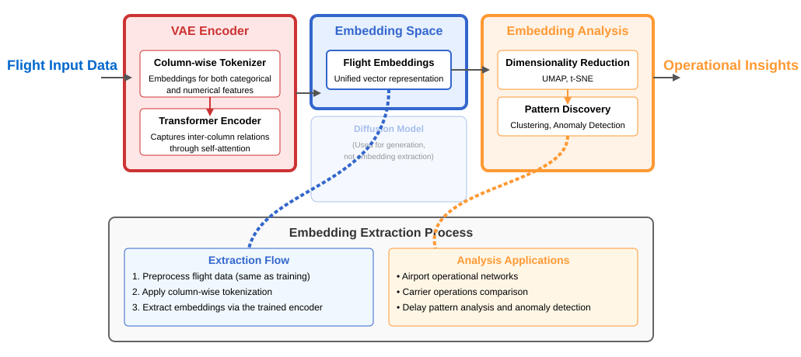
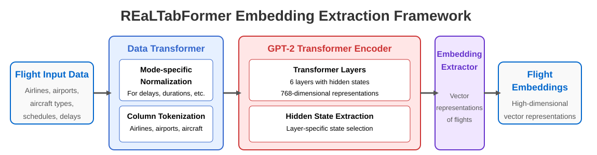
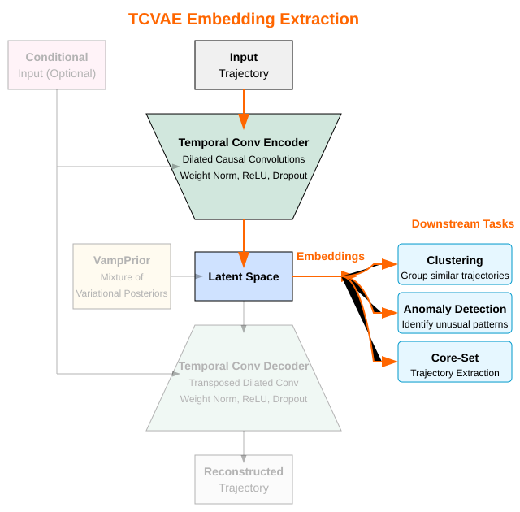

# Embedding Framework for Air Traffic Management

This framework presents general-purpose embeddings extracted from Air Traffic Management (ATM) data, leveraging latent representations learned during synthetic data generation. These embeddings transform both flight records and trajectories into compact vector representations that capture operational patterns, temporal dynamics, and statistical relationships. Open-source implementations are available in our [embedding repositories](/repositories/repositories.html#embedding-models). Publications are still under review. Public deliverables describing the embedding framework are currently under evaluation by the SESAR Joint Undertaking and will be made publicly available upon approval.

## Overview

The embedding framework consists of four specialized models that transform different types of ATM data into meaningful vector representations:

- **TabSyn**: VAE-based embeddings for tabular flight operational data
- **REaLTabFormer**: Transformer-based embeddings for structured flight records
- **TCVAE**: Temporal convolutional embeddings for flight trajectories
- **Latent Flow Matching**: Advanced embedding approach enabling transfer learning

## Tabular Data Embeddings

### TabSyn Embedding Framework

  
   
  <em><strong>Figure 1: TabSyn Embedding Extraction Process</strong>. Flight data passes through column-wise tokenization and transformer encoding to produce unified vector representations. The embedding extraction uses only the encoder component, bypassing decoder and diffusion components used for generation.</em>

**TabSyn** provides powerful embeddings for flight operational data through its VAE-based architecture. The embedding process involves:

- **Column-aware tokenization**: Type-specific processing for numerical features (delays, durations) and categorical features (airports, carriers, aircraft types)
- **Transformer encoding**: Multi-head attention mechanisms capture relationships between flight attributes
- **Latent space extraction**: Mean vector (μ) from the VAE encoder provides compact representations

**Key Properties:**
- Operational similarity preservation: Similar flights cluster together regardless of superficial differences
- Density-based structure: Common patterns form high-density regions, anomalies appear in sparse areas
- Probabilistic representation: VAE framework captures uncertainty in flight operations

### REaLTabFormer Embedding Framework

  
   
  <em><strong>Figure 2: REaLTabFormer Embedding Extraction Framework</strong>. The transformer processes tokenized flight data through six layers, producing contextually rich representations that capture sequential dependencies and operational patterns.</em>

**REaLTabFormer** leverages transformer architecture to create contextually rich embeddings:

- **Token-level processing**: Each flight attribute undergoes column-aware embedding and partitioned numerical representation
- **Sequential encoding**: GPT-2 transformer layers capture dependencies between flight attributes
- **Flexible extraction**: Multiple aggregation strategies (mean pooling, CLS token, full sequence)

**Applications:**
- Airport operational network analysis via embedding similarity
- Route-specific operational signature identification
- Seasonal pattern analysis in flight embeddings
- Carrier-specific operational profile detection
- Delay and turnaround pattern analysis

## Time Series Embeddings

### TCVAE Embedding Framework

  
   
  <em><strong>Figure 3: TCVAE Embedding Process</strong>. Flight trajectories are processed through temporal convolutional encoding into compact latent representations suitable for clustering, anomaly detection, and core-set extraction.</em>

**TCVAE** (Temporal Convolutional Variational Autoencoder) transforms flight trajectories into meaningful vector embeddings:

- **Temporal convolutional encoding**: Dilated causal convolutions capture multi-scale temporal dependencies
- **Variational latent space**: Probabilistic representations with uncertainty quantification
- **Trajectory preservation**: Essential spatial-temporal patterns maintained in compressed form

**Capabilities:**
- Trajectory clustering and pattern discovery
- Anomaly detection for unusual flight paths
- Core-set trajectory extraction for simulation
- Smooth interpolation between trajectory patterns

### Transfer Learning with Latent Flow Matching

  
   
  <em><strong>Figure 4: Transfer Learning with Latent Flow Matching</strong>. Two-phase process: pretraining on source airport data, then transferring and fine-tuning on target airport with limited data. Enables effective modeling of airports with sparse datasets.</em>

**Latent Flow Matching** combines VAE representations with flow matching for advanced embedding capabilities:

- **Phase 1**: Pretraining on source airport with complete trajectory data
- **Phase 2**: Transfer learning to target airport using limited data (5%, 20%, or 100%)
- **Dual component transfer**: Both VAE encoder/decoder and flow matching network adapt to new domains

**Benefits:**
- Efficient knowledge transfer between airports
- Effective modeling with limited target data
- Preservation of trajectory quality during transfer
- Computational efficiency through latent space operations

## Applications

### Operational Analysis
- **Pattern Discovery**: Identify common operational signatures across carriers, routes, and airports
- **Anomaly Detection**: Detect unusual flights and operational conditions through embedding space analysis
- **Clustering**: Group similar flight patterns for operational insights and procedure validation

### Simulation and Modeling
- **Core-Set Extraction**: Select representative trajectories that capture essential patterns for efficient simulation
- **Transfer Learning**: Apply models trained on data-rich airports to airports with limited datasets
- **Synthetic Data Generation**: Use embeddings to guide generation of realistic synthetic flight data

### Performance Optimization
- **Computational Efficiency**: Reduced dimensional representations accelerate downstream analyses
- **Memory Efficiency**: Compact embeddings enable analysis of large-scale flight datasets
- **Scalability**: Framework supports analysis across multiple airports and operational contexts
