# Tabular Data Embeddings for Air Traffic Management

This section presents specialized embedding models for transforming flight operational data into compact vector representations. These embeddings leverage latent representations learned during synthetic data generation to enable operational pattern discovery, anomaly detection, and comparative analysis of flight characteristics.

## Tabular Embedding Models

### TabSyn Embedding Framework

  
   
  <em><strong>Figure 1: TabSyn Embedding Extraction Process</strong>. Flight data passes through column-wise tokenization and transformer encoding to produce unified vector representations. The embedding extraction uses only the encoder component, bypassing decoder and diffusion components used for generation.</em>

**TabSyn** generates embeddings for flight operational data through its VAE-based architecture. The embedding process involves:

- **Column-aware tokenization**: Type-specific processing for numerical features (delays, durations) and categorical features (airports, carriers, aircraft types)
- **Transformer encoding**: Multi-head attention mechanisms capture relationships between flight attributes
- **Latent space extraction**: Mean vector (μ) from the VAE encoder provides compact representations

### REaLTabFormer Embedding Framework

  
   
  <em><strong>Figure 2: REaLTabFormer Embedding Extraction Framework</strong>. The transformer processes tokenized flight data through six layers, producing contextual representations that capture sequential dependencies and operational patterns.</em>

**REaLTabFormer** uses transformer architecture to create contextual embeddings:

- **Token-level processing**: Each flight attribute undergoes column-aware embedding and partitioned numerical representation
- **Sequential encoding**: GPT-2 transformer layers capture dependencies between flight attributes
- **Flexible extraction**: Multiple aggregation strategies (mean pooling, CLS token, full sequence)

## Tabular Embedding Applications

### Operational Cluster Detection

The embedding space reveals distinct operational clusters that correspond to different flight patterns and characteristics:

  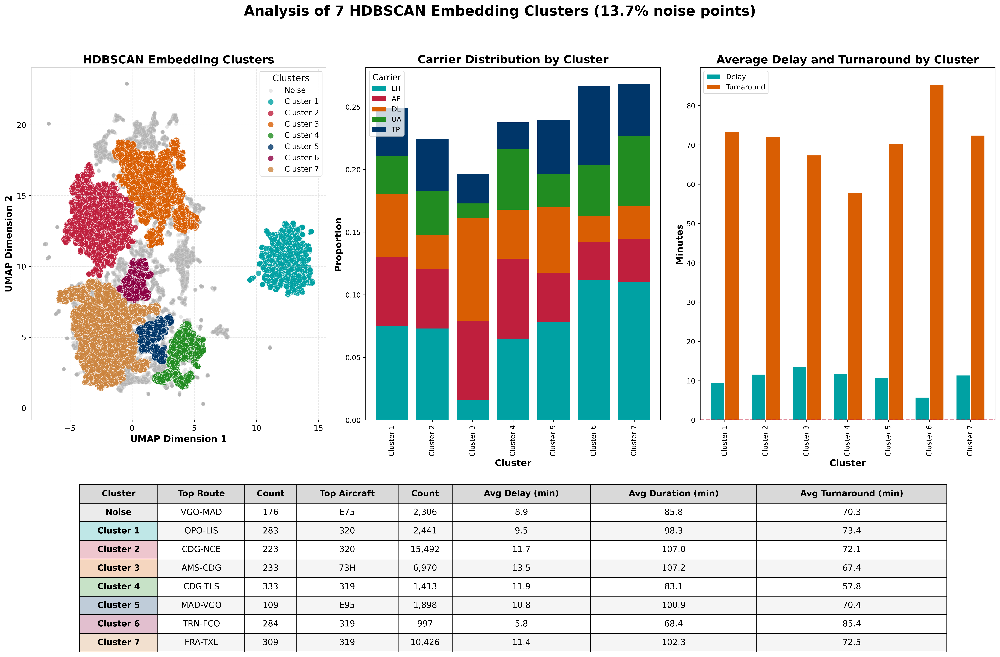
   
  <em><strong>Figure 3: Embedding Clusters</strong>. Visualization of flight embeddings showing distinct operational clusters that correspond to different flight patterns and characteristics.</em>

  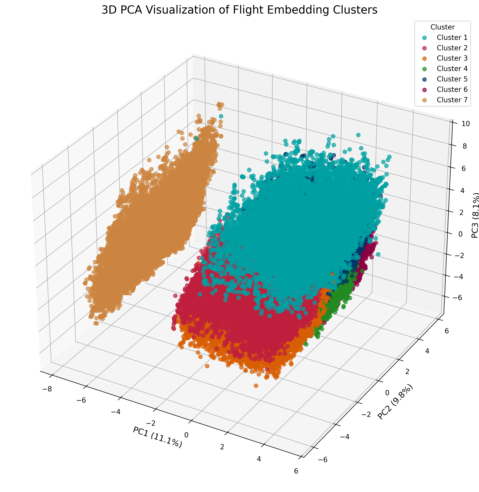
   
  <em><strong>Figure 4: 3D PCA Visualization</strong>. Three-dimensional PCA projection of flight embeddings revealing the hierarchical structure of operational patterns.</em>

### Airport Operational Networks via Embedding Similarity

Embeddings enable analysis of airport operational networks through similarity measures:

  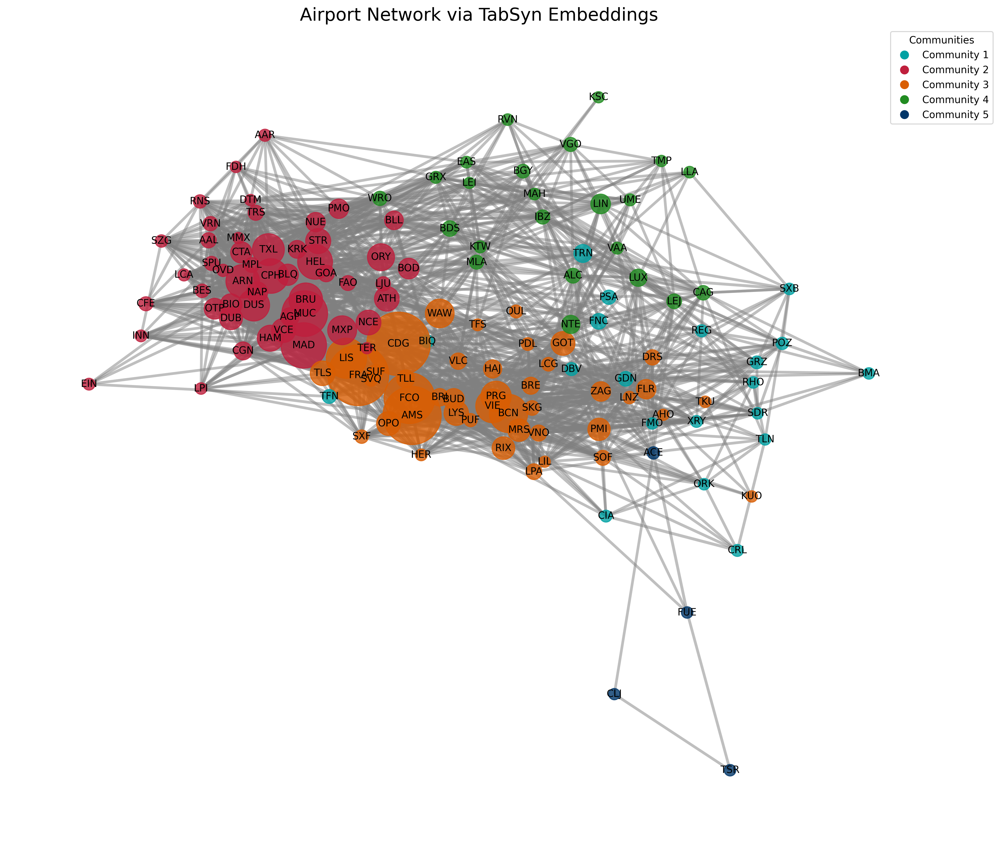
   
  <em><strong>Figure 13: Airport Network Visualization</strong>. Network graph showing airport relationships based on embedding similarity.</em>

### Anomaly Detection via Embedding Analysis

The embedding space enables effective anomaly detection by identifying flights in sparse regions:

  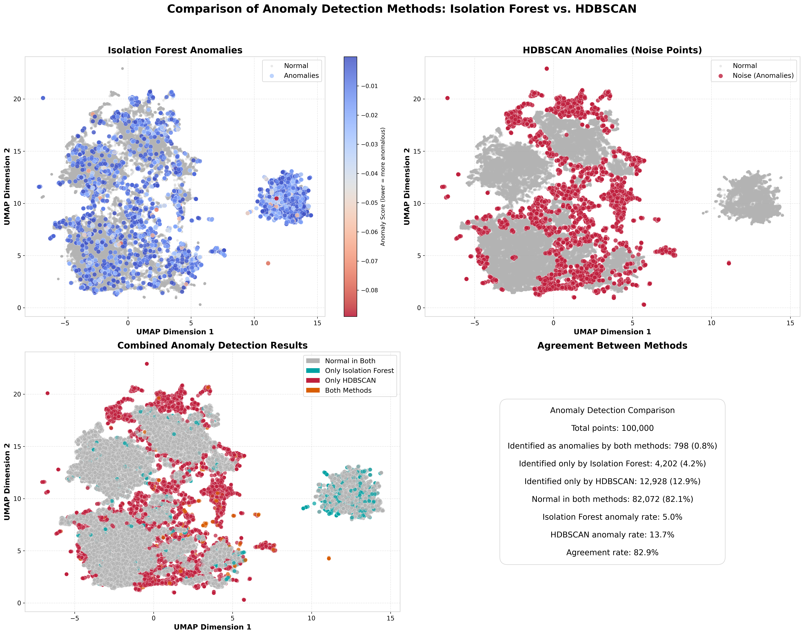
   
  <em><strong>Figure 14: Anomaly Detection</strong>. Comparison of normal and anomalous flights in the embedding space.</em>

### Delay Pattern Analysis in Embedding Space

The embedding space effectively captures delay patterns, enabling comprehensive analysis of delay dynamics:

  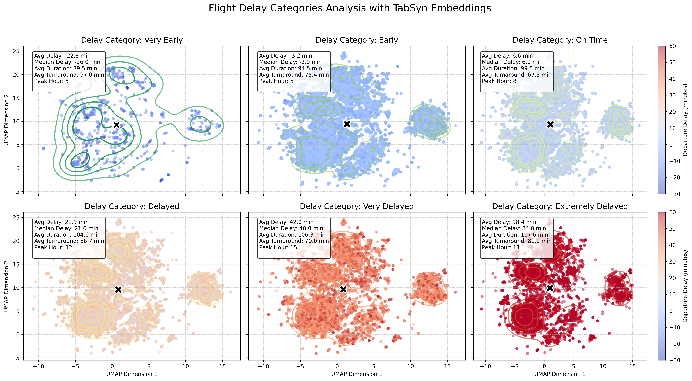
   
  <em><strong>Figure 6: Delay Pattern Analysis</strong>. Embedding space visualization showing how different delay patterns cluster in the latent representation.</em>

### Turnaround Pattern Analysis in Embedding Space

The embedding space captures turnaround time patterns, enabling analysis of ground operations efficiency:

  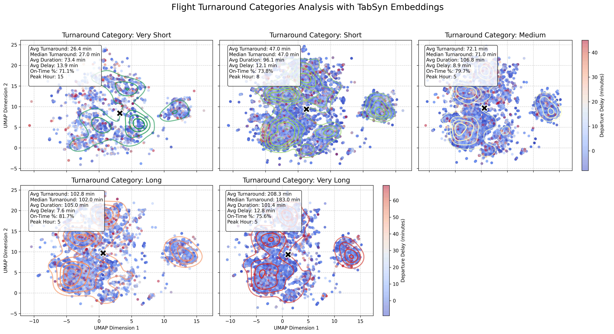
   
  <em><strong>Figure 8: Turnaround Pattern Analysis</strong>. Visualization showing how different turnaround time patterns are distributed in the embedding space.</em>

### Carrier-Specific Operational Profiles

Embeddings reveal distinct carrier-specific operational characteristics and patterns:

  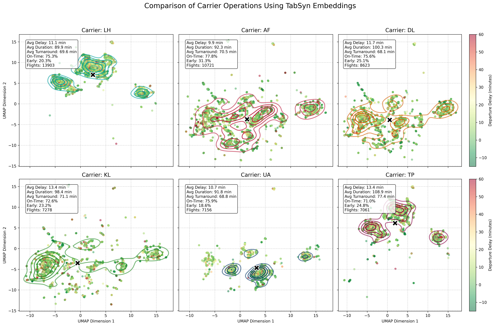
   
  <em><strong>Figure 10: Carrier Comparison</strong>. UMAP visualization showing how different carriers cluster in the embedding space, revealing distinct operational profiles.</em>

### Route-Specific Operational Signatures

The embedding framework enables analysis of route-specific operational signatures:

  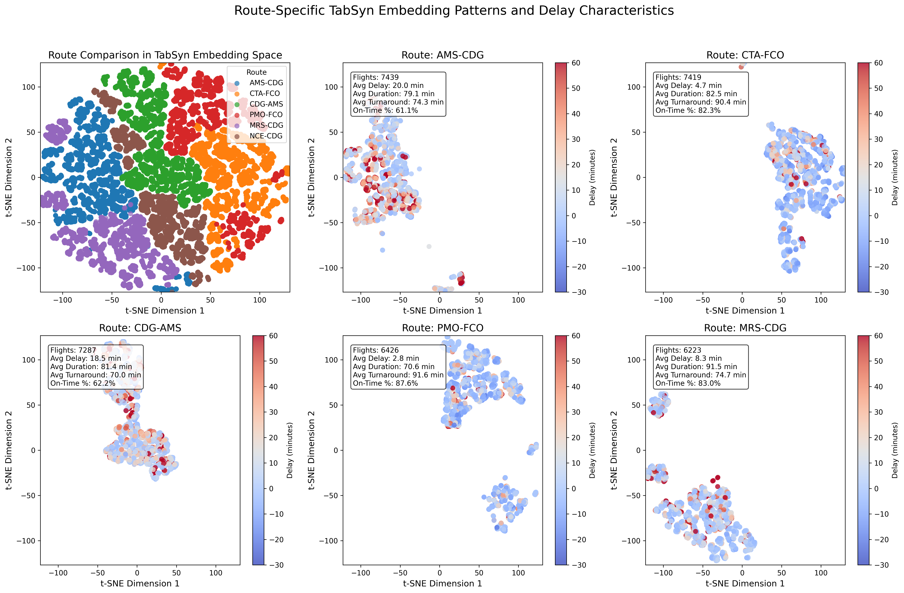
   
  <em><strong>Figure 11: Route Embedding Comparison</strong>. Comparison of embedding distributions for different route categories.</em>

### Seasonal Patterns in Flight Embeddings

Embeddings capture temporal variations in operational patterns across different seasons:

  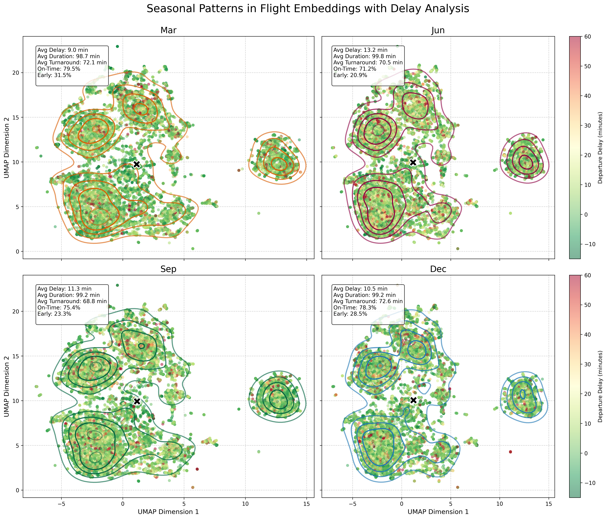
   
  <em><strong>Figure 12: Seasonal Patterns</strong>. Analysis of how seasonal factors influence flight operation patterns in the embedding space.</em>

### PCA Component Interpretation

Principal component analysis reveals the main sources of variation in flight operations:

  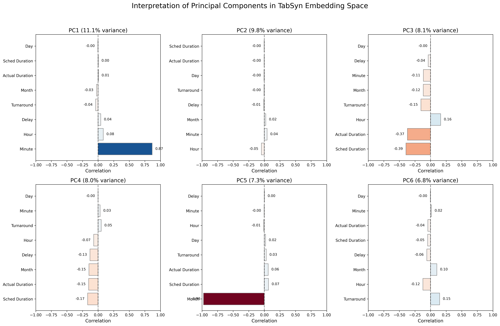
   
  <em><strong>Figure 15: PCA Component Interpretation</strong>. Analysis of principal components showing which operational factors contribute most to embedding variation.</em>

### Navigating Operational Dimensions in Latent Space

Interactive exploration of the embedding space enables deeper understanding of operational patterns:

  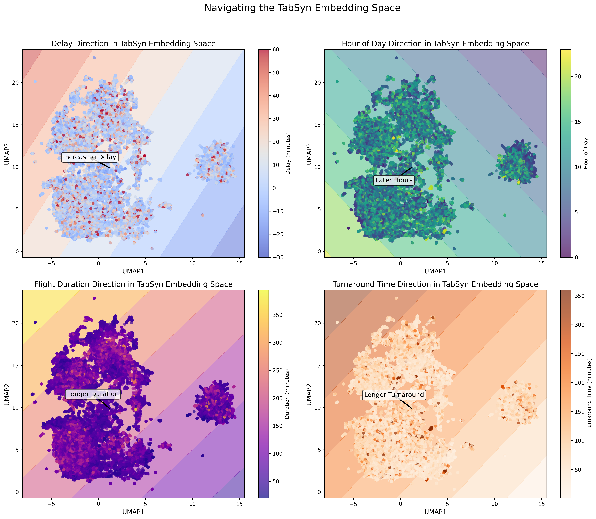
   
  <em><strong>Figure 16: Embedding Navigation</strong>. Interactive visualization tool for exploring the embedding space and understanding operational patterns.</em>

## Summary

The analysis results show that these embedding frameworks capture the relationships in flight operational data, enabling downstream applications from pattern discovery to anomaly detection.

