# Time Series Embeddings for Air Traffic Management

This section presents embedding approaches for transforming flight trajectories into compact vector representations. These embeddings enable trajectory clustering, anomaly detection, core-set extraction, and transfer learning applications.

## Embedding Approaches

### TCVAE Framework

  
   
  <em><strong>Figure 1: TCVAE Embedding Process</strong>. Flight trajectories are processed into compact latent representations for clustering, anomaly detection, and core-set extraction.</em>

**TCVAE** transforms flight trajectories into vector embeddings using temporal convolutional encoding and variational latent representations.

### Latent Flow Matching Framework

  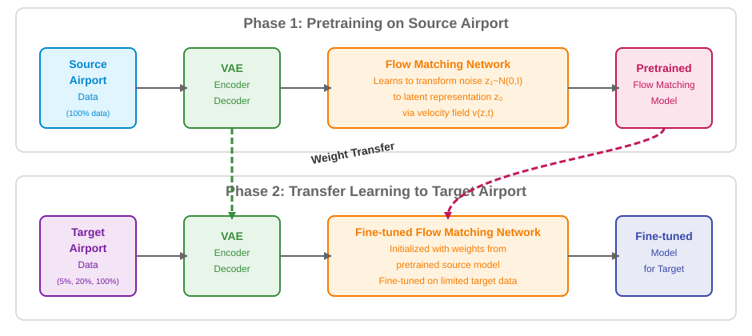
   
  <em><strong>Figure 39: Transfer Learning with Latent Flow Matching</strong>. Two-phase process: pretraining on source airport data, then transferring to target airport with limited data. Enables modeling of airports with sparse datasets.</em>

**Latent Flow Matching** combines VAE representations with flow matching for transfer learning applications, using a two-phase approach from source to target airports.

## Trajectory Clustering Applications

### Landing Trajectory Analysis

The TCVAE embeddings enable clustering of landing trajectories, revealing approach patterns for different airports.

#### Dublin (EIDW) Landing Trajectories

  
   
  <em><strong>Figure 7: Dublin Raw Landing Trajectories</strong>. Collection of raw landing trajectories for Dublin airport.</em>

  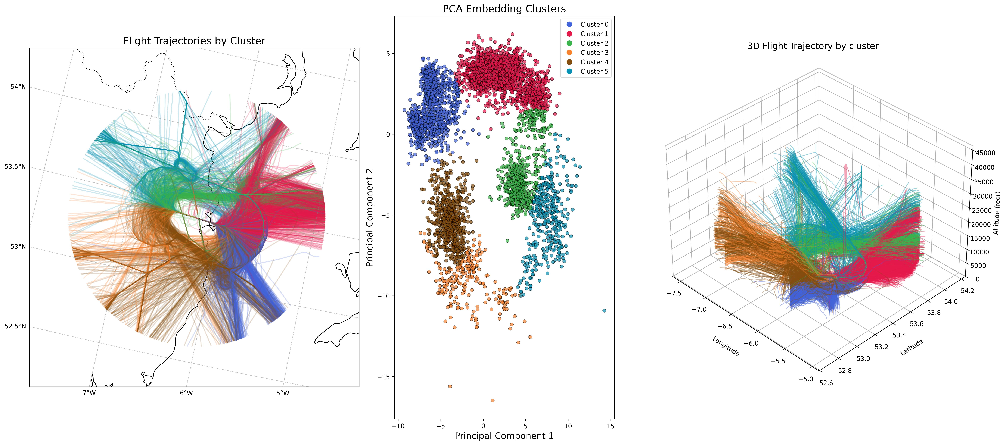
   
  <em><strong>Figure 8: Dublin GMM Clustering</strong>. Gaussian Mixture Model clustering identifying distinct approach patterns for Dublin.</em>

  
   
  <em><strong>Figure 10: Dublin HDBSCAN Clustering (With Outliers)</strong>. Complete clustering including anomalous trajectories.</em>

  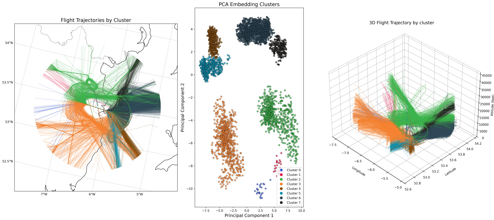
   
  <em><strong>Figure 9: Dublin HDBSCAN Clustering (No Outliers)</strong>. Main approach pattern clusters for Dublin airport.</em>

  
   
  <em><strong>Figure 11: Dublin Representative Trajectories</strong>. Core representative trajectories for each identified cluster.</em>

#### London (EGLL) Landing Trajectories

  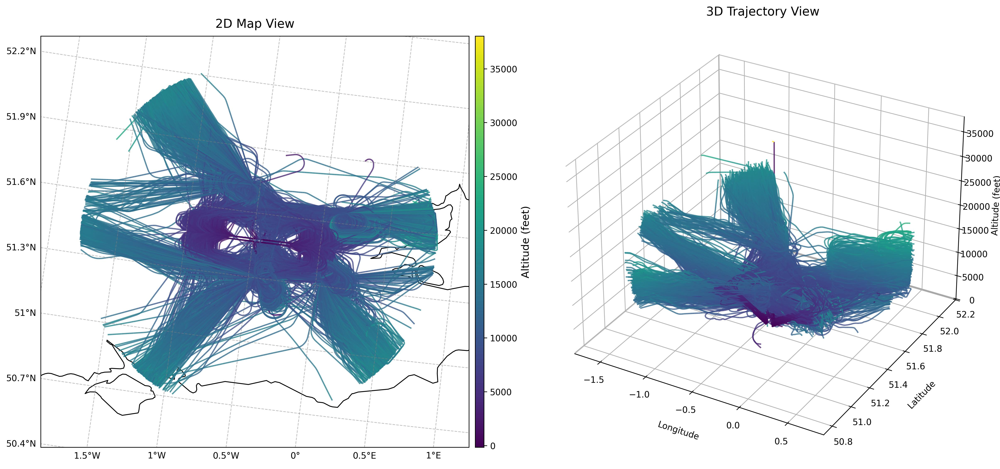
   
  <em><strong>Figure 12: London Raw Landing Trajectories</strong>. Raw landing trajectories showing London Heathrow's complex approach patterns.</em>

  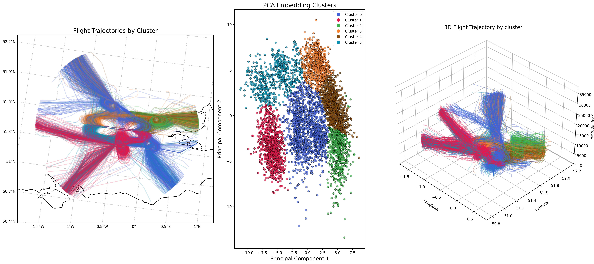
   
  <em><strong>Figure 13: London GMM Clustering</strong>. GMM clustering results for London Heathrow approach patterns.</em>

  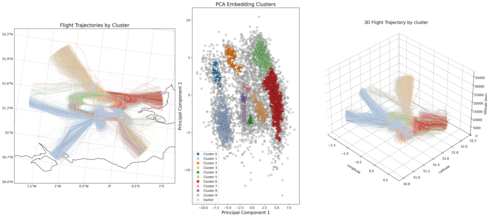
   
  <em><strong>Figure 15: London HDBSCAN Clustering (With Outliers)</strong>. Complete clustering analysis including outlier detection.</em>

  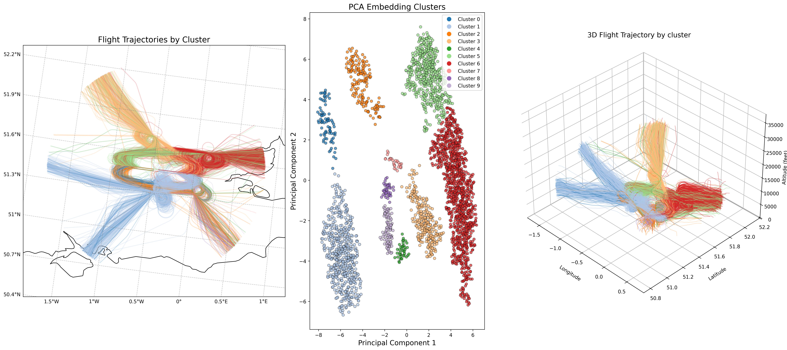
   
  <em><strong>Figure 14: London HDBSCAN Clustering (No Outliers)</strong>. Primary approach clusters for London Heathrow.</em>

  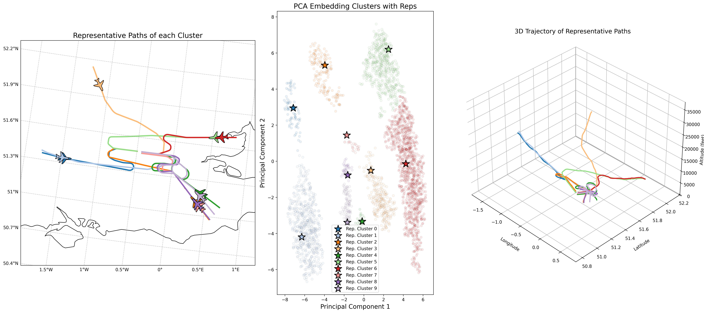
   
  <em><strong>Figure 16: London Representative Trajectories</strong>. Representative trajectories for each approach pattern cluster.</em>

#### Paris (LFPG) Landing Trajectories

  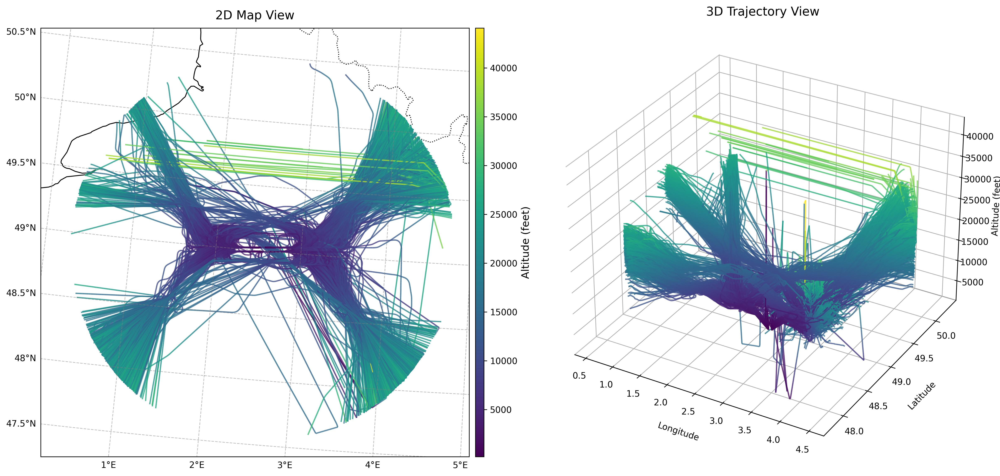
   
  <em><strong>Figure 17: Paris Raw Landing Trajectories</strong>. Raw landing trajectories for Paris Charles de Gaulle airport.</em>

  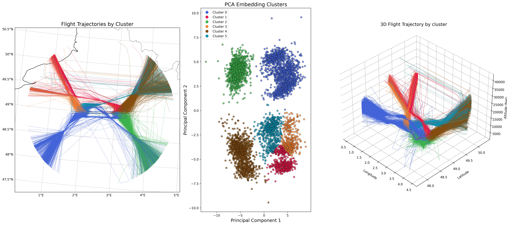
   
  <em><strong>Figure 18: Paris GMM Clustering</strong>. Gaussian Mixture Model clustering for Paris approach patterns.</em>

  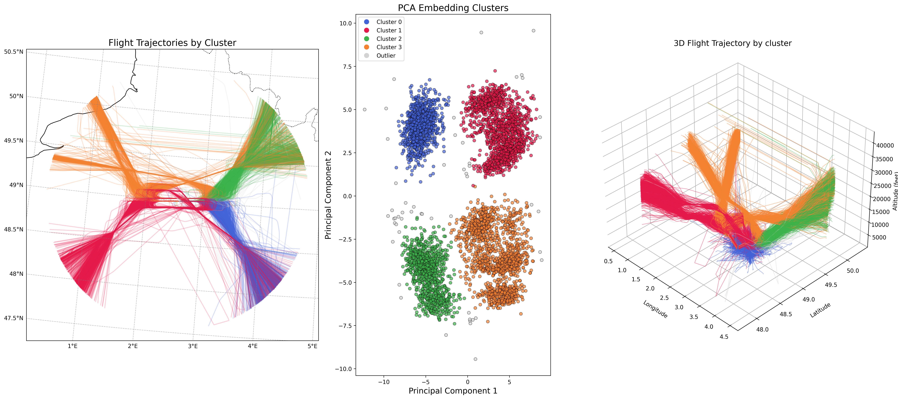
   
  <em><strong>Figure 20: Paris HDBSCAN Clustering (With Outliers)</strong>. Complete clustering including anomaly identification.</em>

  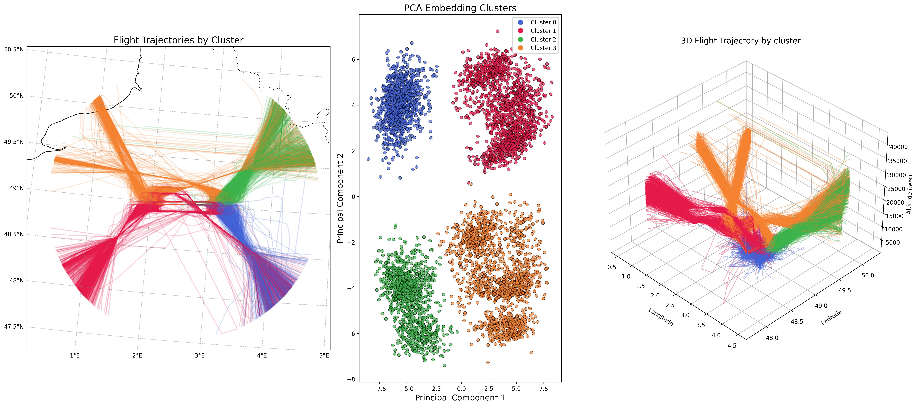
   
  <em><strong>Figure 19: Paris HDBSCAN Clustering (No Outliers)</strong>. Main approach pattern identification for Paris CDG.</em>

  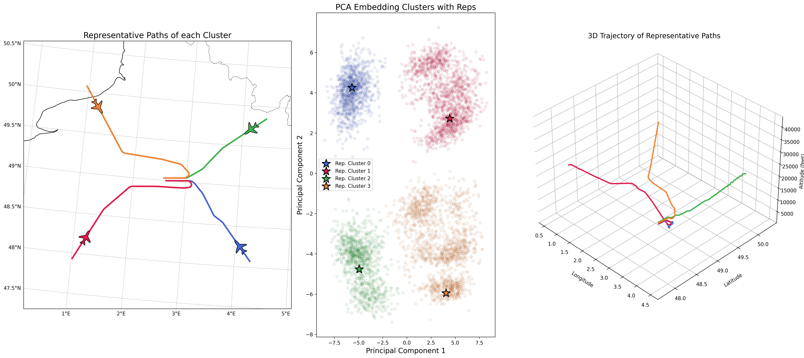
   
  <em><strong>Figure 21: Paris Representative Trajectories</strong>. Core trajectories representing each cluster's characteristics.</em>

#### Zurich (LSZH) Landing Trajectories

  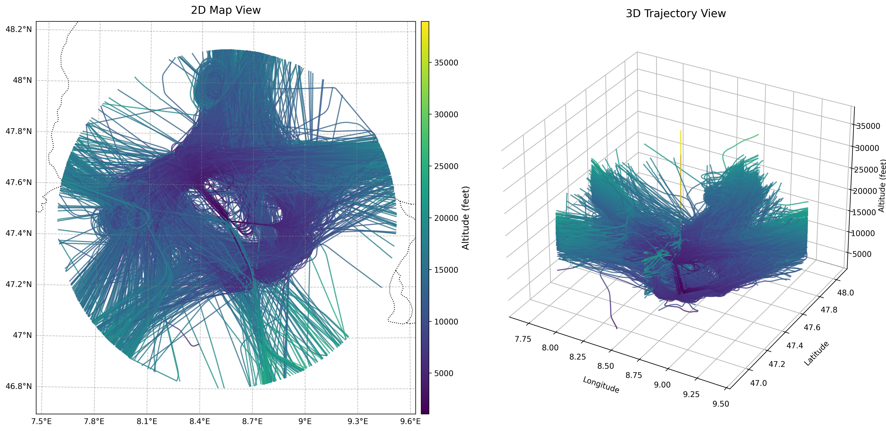
   
  <em><strong>Figure 22: Zurich Raw Landing Trajectories</strong>. Raw landing trajectories showing Zurich's approach patterns.</em>

  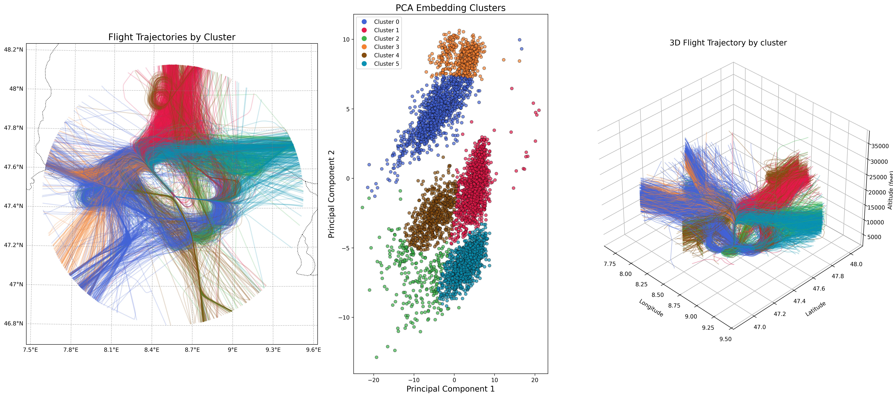
   
  <em><strong>Figure 23: Zurich GMM Clustering</strong>. GMM clustering results for Zurich approach patterns.</em>

  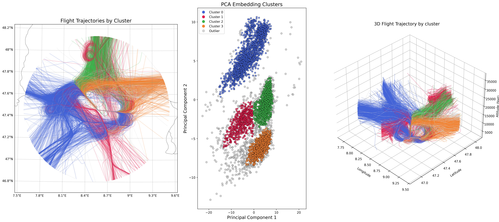
   
  <em><strong>Figure 25: Zurich HDBSCAN Clustering (With Outliers)</strong>. Complete clustering with outlier trajectory identification.</em>

  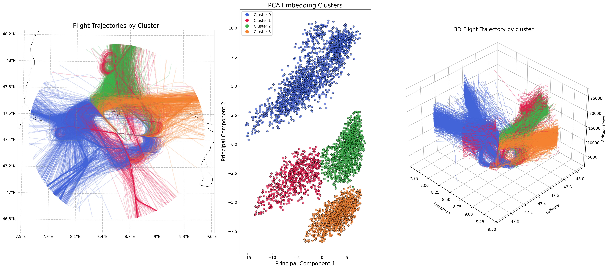
   
  <em><strong>Figure 24: Zurich HDBSCAN Clustering (No Outliers)</strong>. Primary approach clusters for Zurich airport.</em>

  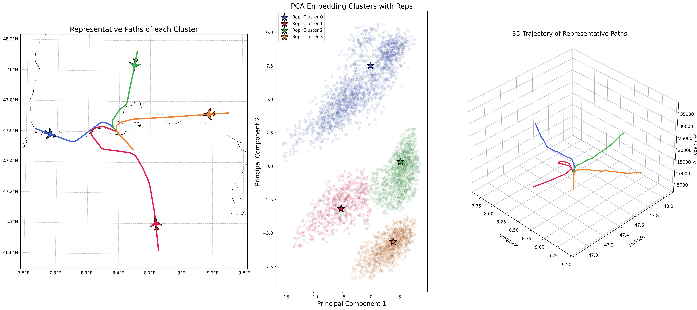
   
  <em><strong>Figure 26: Zurich Representative Trajectories</strong>. Representative trajectories for each identified cluster.</em>

## End-to-End Route Analysis

### Complete Route Trajectories

The embeddings also enable analysis of complete end-to-end flight routes, revealing patterns in full journey trajectories.

#### Amsterdam to Milan Route (EHAM-LIMC)

  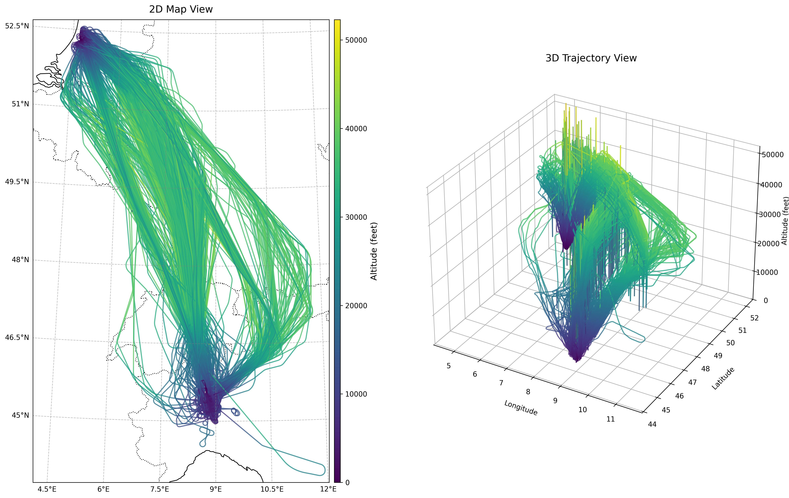
   
  <em><strong>Figure 27: EHAM-LIMC Raw Trajectories</strong>. Raw trajectories for flights between Amsterdam and Milan.</em>

  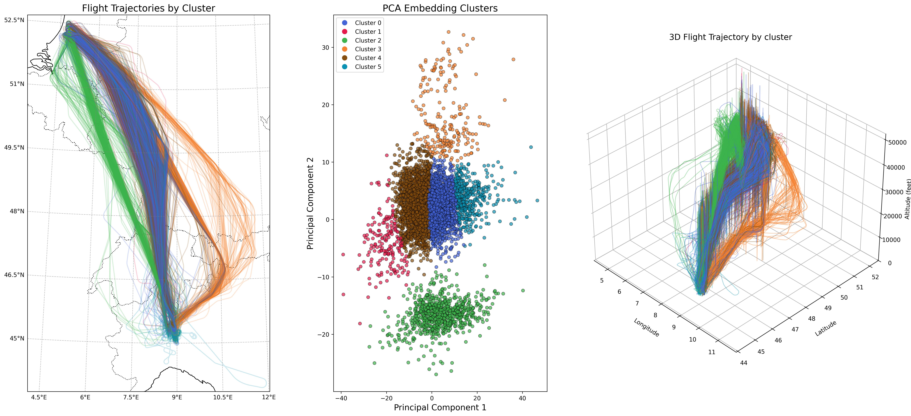
   
  <em><strong>Figure 28: EHAM-LIMC GMM Clustering</strong>. Route clustering showing different path preferences.</em>

#### Stockholm to Paris Route (ESSA-LFPG)

  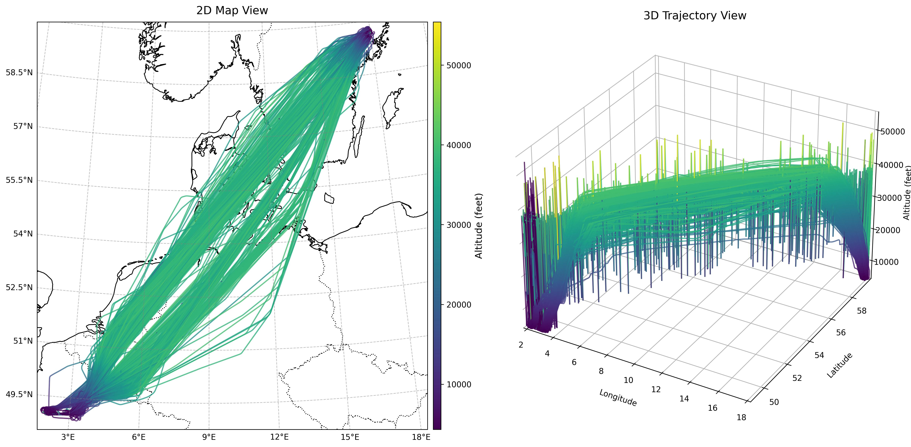
   
  <em><strong>Figure 31: ESSA-LFPG Raw Trajectories</strong>. Raw trajectories for flights between Stockholm and Paris.</em>

  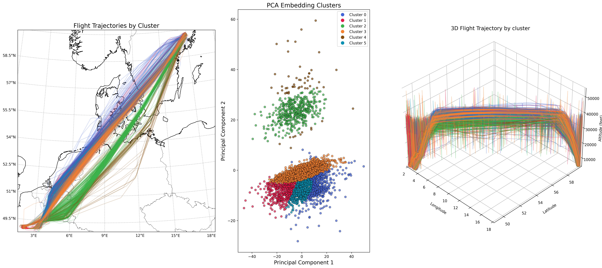
   
  <em><strong>Figure 32: ESSA-LFPG GMM Clustering</strong>. Route pattern identification for Stockholm-Paris flights.</em>

#### Vienna to London Route (LOWW-EGLL)

  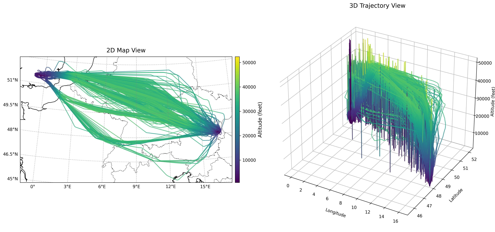
   
  <em><strong>Figure 35: LOWW-EGLL Raw Trajectories</strong>. Raw trajectories for flights between Vienna and London.</em>

  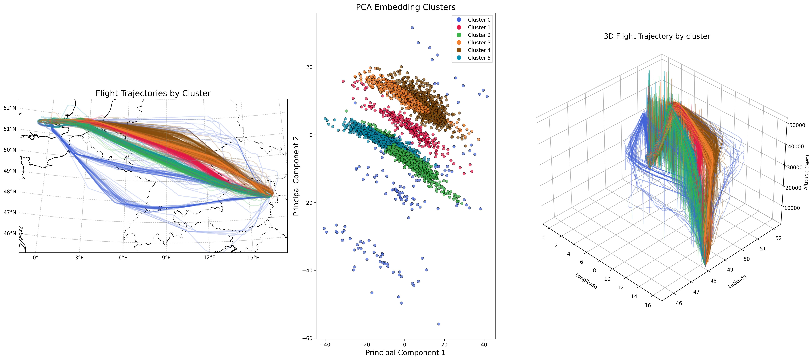
   
  <em><strong>Figure 36: LOWW-EGLL GMM Clustering</strong>. Route clustering for Vienna-London flights.</em>

## Transfer Learning Applications

Transfer learning extends trajectory generation to airports or routes with limited historical data, demonstrating knowledge transfer between different operational contexts.

### Performance Comparison with 5% Target Data

<table>
  <tr>
    <td width="50%">
      
      
<em>No Pretraining (5% Data)</em>

    </td>
    <td width="50%">
      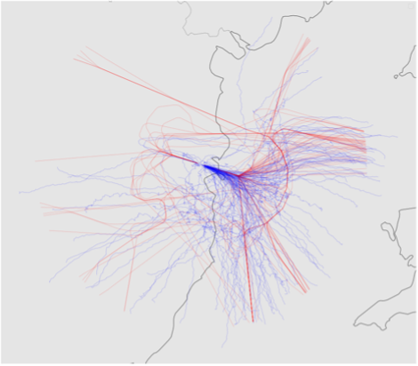
      
<em>With Transfer Learning (5% Data)</em>

    </td>
  </tr>
</table>

*Comparison showing improved trajectory quality when using transfer learning with only 5% of target airport data*

### Performance Comparison with 20% Target Data

<table>
  <tr>
    <td width="50%">
      
      
<em>No Pretraining (20% Data)</em>

    </td>
    <td width="50%">
      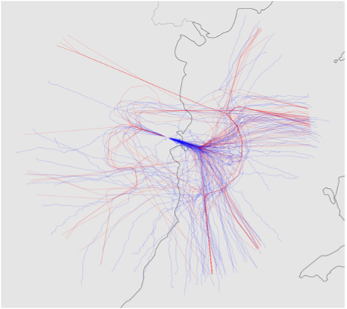
      
<em>With Transfer Learning (20% Data)</em>

    </td>
  </tr>
</table>

*Trajectory quality comparison showing sustained transfer learning benefits with increased target data availability*

**Key transfer learning findings:**
- Improved trajectory quality with minimal target airport data
- Knowledge preservation of general flight dynamics across different operational contexts
- Data efficiency enabling generation with as little as 5-20% of full datasets
- Applicability for airports or routes with limited historical trajectory data

Transfer learning applications include:
- Regional airports with sparse historical data
- New routes requiring trajectory modeling
- Seasonal operations with limited data periods
- Emergency scenarios with rare operational patterns

## Applications

### Operational Analysis
- Pattern discovery across routes and airports
- Anomaly detection for unusual trajectories
- Trajectory clustering for operational insights

### Simulation and Modeling
- Core-set extraction of representative trajectories
- Transfer learning between airports
- Synthetic data generation

### Performance Benefits
- Reduced computational requirements
- Efficient analysis of large trajectory datasets
- Scalable across multiple airports

## Summary

These embedding frameworks capture the spatial-temporal dynamics of flight trajectories, enabling trajectory clustering, transfer learning between airports, and operational applications. Transfer learning allows models trained on data-rich airports to work effectively with limited target data (as little as 5-20% of full datasets), supporting route optimization across airports with varying data availability.