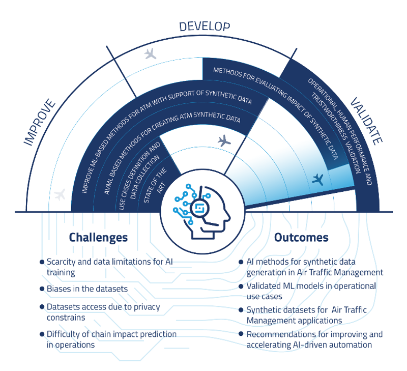

SynthAIr is two-year project supported by SESAR 3 Joint Undertaking. The project explore and define novel AI-based methods for synthetic data generation in the domain of air traffic management (ATM) system. SynthAIr’s mission is to increase the level of automation, leveraging the potential of synthetic data for tackling structural obstacles such as data access and scarcity, privacy issues and bias in the data.

Officially launched on 1 September 2023, SynthAIr's consortium is led by [SINTEF](https://www.sintef.no/en/) and includes [Deep Blue](https://dblue.it/en/), [Eurocontrol](https://www.eurocontrol.int/) and [Delft University of Technology](https://www.tudelft.nl/en/).

## Use Case 1: Synthetic Trajectory Generation

In this use case, we aims to generate synthetic aircraft trajectories, using various generative models. We focuses on generating realistic aircraft trajectories that can be used for various downstream applications, such as air traffic simulation, capacity planning, and data augmentation.

## Use Case 2: Flight schedule

## Use Case 3: Flight Delay

## Use Case 4: Flight Diversion

