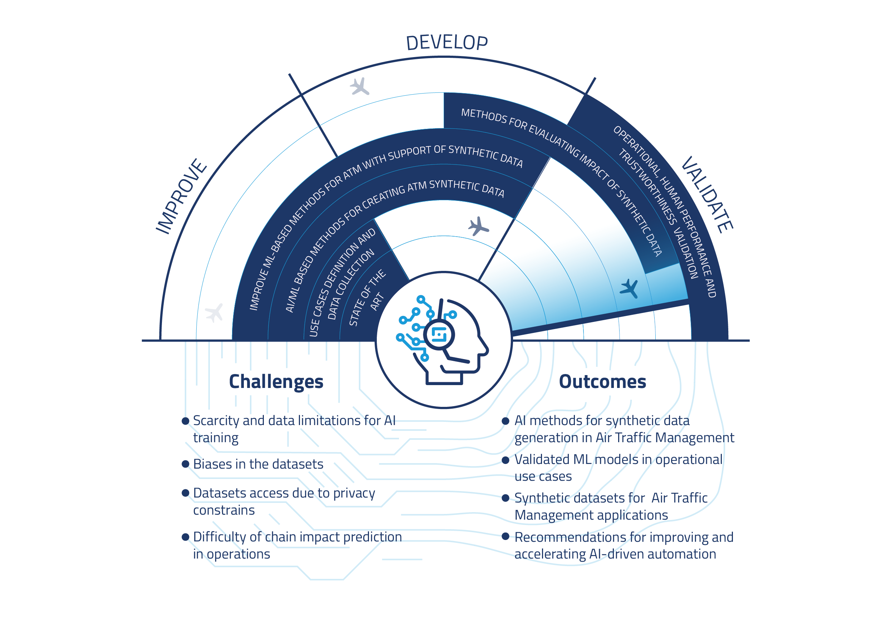
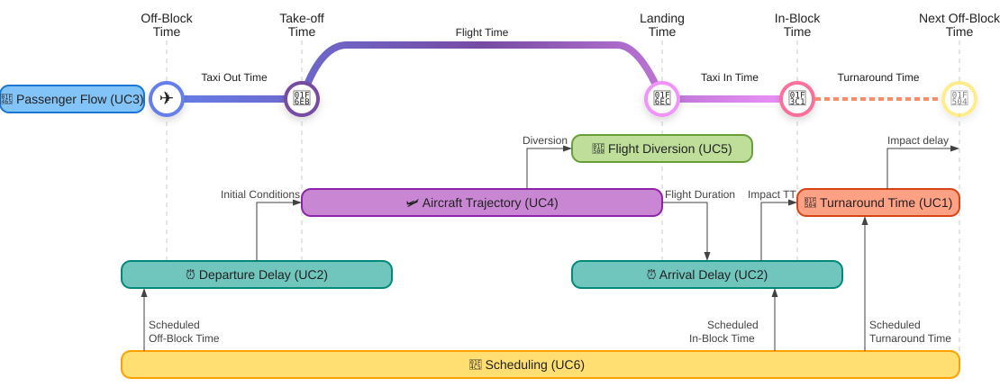

# Transforming ATM Through AI-Powered Synthetic Data Generation

**SynthAIr** advances Air Traffic Management (ATM) automation through AI methods for synthetic data generation. This EU-funded research initiative (SESAR 3 Joint Undertaking) addresses critical challenges of data scarcity, privacy constraints, and operational complexity by delivering **10 generative models** validated across **6 operational use cases** spanning the complete flight lifecycle.

  
   
  <em><strong>Figure 1: SynthAIr Concept - AI Models for ATM Data Generation</strong></em>

## Research Challenge & Innovation

The aviation industry faces persistent barriers in developing AI systems due to:
- **Data Scarcity**: Limited access to comprehensive operational datasets
- **Privacy Constraints**: Commercial sensitivity preventing data sharing
- **Operational Complexity**: Diverse stakeholder requirements and safety-critical environments
- **Regulatory Barriers**: Strict compliance requirements limiting data availability

SynthAIr addresses this challenge by creating **synthetic datasets that preserve statistical properties and operational relationships** of real ATM data while enabling unrestricted access for research and development.

## Validated Use Cases

The six use cases demonstrate synthetic data generation capabilities across critical ATM operational scenarios:

  
   
  <em><strong>Figure 2: SynthAIr Use Cases Across the Flight Timeline</strong> 
  Six operational scenarios spanning the complete flight lifecycle from turnaround to turnaround. The diagram illustrates temporal relationships between flight phases (Off-Block Time ✈️, Take-off Time 🛫, Landing Time 🛬, In-Block Time 🏁) and how synthetic data generation addresses specific operational challenges. Each use case connects to critical decision points: UC6 (Scheduling) spans the entire timeline for strategic planning, UC3 (Passenger Flow) occurs during ground operations, UC2 (Delay Prediction) targets departure and arrival phases, UC4 (Trajectory Generation) covers en-route flight, UC5 (Flight Diversion) handles contingency scenarios, and UC1 (Turnaround Time) optimizes ground operations between flights. The interconnected arrows demonstrate data dependencies and operational impact propagation across phases.</em>

**[UC1 - Turnaround Time Prediction](use-cases/uc1-turnaround)**: Predicts the duration from aircraft In-Block to Off-Block, addressing the fact that over 40% of primary airport delays are generated by turnaround processes. Synthetic data generation enables optimization of ground handling operations including boarding, fueling, cleaning, catering, and baggage handling while preserving operational confidentiality.

**[UC2 - Flight Delay Prediction](use-cases/uc2-flight-delay)**: Addresses flight delays - both primary (aircraft maintenance, cleaning) and propagated (cascading effects from previous delays, crew rotations). With average European delays reaching 14.5 minutes per flight in Q1 2023, synthetic data enables comprehensive delay modeling while bridging gaps in real-time data exchange between airports.

**[UC3 - Passenger Flow Prediction](use-cases/uc3-passenger-flow)**: Tackles passenger unpredictability that leads to over 50% of delayed flights. Generates synthetic data for terminal processes such as security checks while preserving passenger privacy.

**[UC4 - Synthetic Traffic Generator](use-cases/uc4-traffic-generator)**: Creates realistic aircraft trajectories for ATM simulations, essential for testing new concepts and operational strategies. Leverages data-driven approaches with advanced generative models to produce statistically representative flight paths that maintain spatial-temporal relationships and support fast-time and real-time simulation scenarios.

**[UC5 - Flight Diversion Prediction](use-cases/uc5-flight-diversion)**: Predicts when aircraft cannot land at intended destinations due to weather, medical emergencies, or technical issues. Addresses the challenges of rare events with diverse causes by generating synthetic scenarios for alternative routing and contingency planning.

**[UC6 - Schedule Prediction](use-cases/uc6-schedule-prediction)**: Generates synthetic flight schedules to enhance machine learning models for arrival and departure delay prediction. Addresses the lack of publicly available European schedule data by creating realistic scheduling datasets that span strategic flight planning and resource allocation scenarios.

## Model Portfolio

### [Tabular Data Models](models/tabular) (5 Architectures)
Specialized for flight operational records and mixed-type data:

- **REaLTabFormer**: Transformer-based autoregressive generation
- **TabSyn**: Diffusion models in latent space for efficient mixed-type synthesis
- **CTGAN**: Conditional adversarial training optimized for rare events and imbalanced data
- **TVAE**: Variational autoencoders providing stable training with minimal computational requirements
- **Gaussian Copula**: Statistical approach offering strongest privacy protection

### [Time Series Models](models/timeseries) (5 Architectures)
Specialized architectures for aircraft trajectory generation:

- **TimeVQVAE**: Time-frequency domain processing with transformer priors for global coherence
- **TCVAE with VampPrior**: Temporal convolutional networks with flexible prior distributions  
- **TimeGAN**: Adversarial training preserving temporal relationships and sequential patterns
- **Flow Matching**: Continuous normalizing flows for efficient latent-space trajectory generation
- **Diffusion Models**: Denoising diffusion probabilistic models adapted to aviation spatiotemporal data

## Applications

SynthAIr enables ATM stakeholders to:

✈️ **Develop AI systems** without accessing sensitive operational data  
🔒 **Preserve competitive advantages** while enabling collaborative research  
🎯 **Test rare scenarios** safely through synthetic event generation  
📊 **Share standardized datasets** across organizations and borders  
🚀 **Accelerate research** through publicly available synthetic datasets  
🌍 **Scale solutions globally** via transfer learning capabilities  

## Consortium

  

    
     <small><strong>SINTEF</strong> AI & Machine Learning</small>
  

  

    
     <small><strong>TU Delft</strong> Aviation Engineering</small>
  

  

    
     <small><strong>EUROCONTROL</strong> ATM Operations</small>
  

  

    
     <small><strong>Deep Blue</strong> Data Science</small>
  

**Bringing together expertise** in artificial intelligence (SINTEF), aviation systems (TU Delft), operational air traffic management (EUROCONTROL), and data analytics (Deep Blue).

## Contact

**Project Coordinator:** Massimiliano Ruocco (SINTEF)  
📧 [massimiliano.ruocco@sintef.no](mailto:massimiliano.ruocco@sintef.no)

---

<em>Funded by the SESAR 3 Joint Undertaking under the European Union's Horizon Europe research and innovation programme</em>

