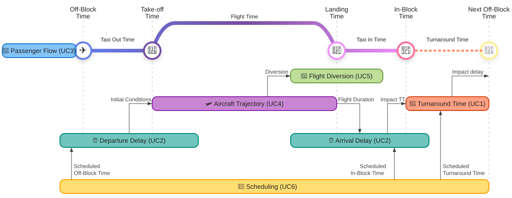
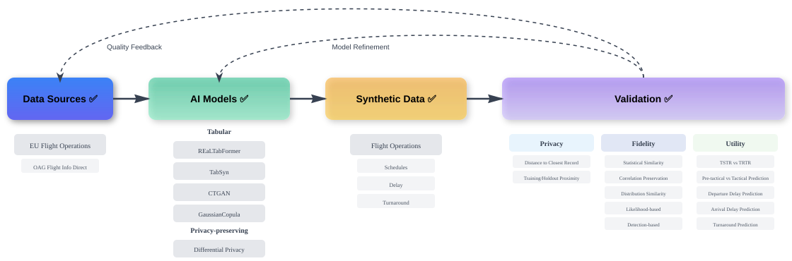
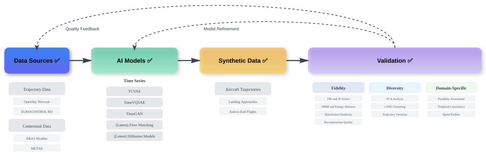

SynthAIr's mission is to increase the level of automation of the ATM system by delivering novel AI-methods for synthetic data generation. This project addresses structural obstacles such as data scarcity by building **9** state-of-the-art generative models across **6** operational use cases.

## Key Contributions
- **Generative Models:** Novel AI methods for generating high-fidelity tabular and time-series data.
- **Embedding Framework:** Universal embeddings for downstream tasks like anomaly detection and transfer learning.
- **Open Source:** **6** public repositories to accelerate research and adoption.

   

     
      ◊
     <em>Use Cases</em>
   

   

     
      ◊
     <em>Tabular generative models</em>
   

   

     
      ◊
     <em>Timeseries generative models</em>
   

