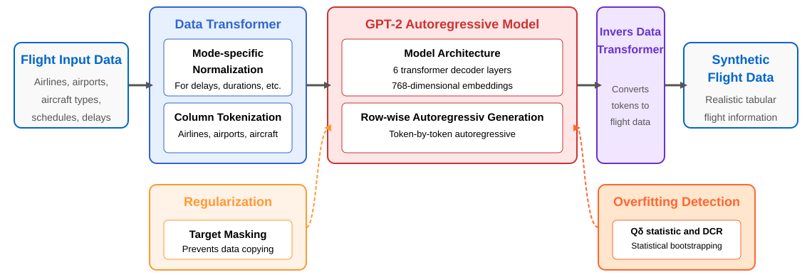
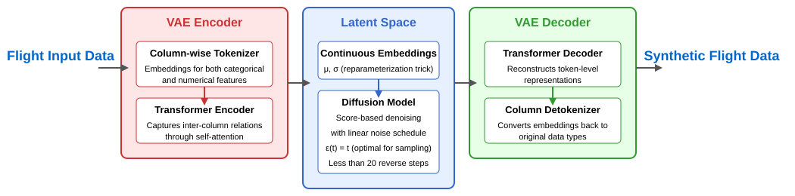
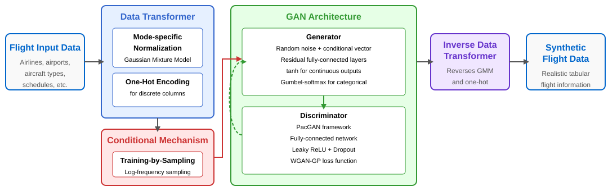
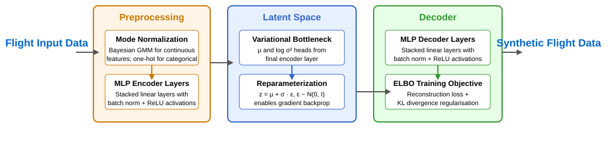

# Tabular Data Generation

The SynthAIr project developed specialized synthetic data generators to address critical challenges in Air Traffic Management: data scarcity, privacy constraints, and commercial sensitivity. Our tabular data pipeline processes mixed-type operational data including flight schedules, delays, and turnaround times using five complementary approaches, each optimized for different data characteristics and use cases. To learn more, see our research publications: [Pre-Tactical Flight-Delay and Turnaround Forecasting with Synthetic Aviation Data](https://doi.org/10.1007/s13272-026-00941-7) and [Synthetic Flight Data Generation Using Generative Models](https://doi.org/10.1109/ICNS65417.2025.10976960). Open-source implementations are available in our [tabular generators repositories](/repositories/repositories.html#tabular-data-generators). Public deliverables are available on [Zenodo](https://zenodo.org/communities/synthair/records).
## Overview

Tabular synthetic data generation in aviation requires handling complex mixed-type datasets with categorical features (airlines, airports, aircraft types), continuous variables (delays, durations), and temporal information (schedules, timestamps). Our approach addresses three fundamental challenges:

- **Data Scarcity**: Limited access to comprehensive flight operations data
- **Privacy Protection**: Commercial sensitivity of operational records
- **Operational Diversity**: Wide range of flight scenarios and conditions

We evaluate generators using the **Train on Synthetic, Test on Real (TSTR)** methodology across three critical prediction tasks: departure delays, arrival delays, and aircraft turnaround times.

  
   
  <em><strong>Figure 1: Tabular Data Generation Pipeline.</strong> From EU flight operations data (OAG), our AI models generate synthetic flight records validated across three dimensions: privacy protection (Distance to Closest Record), statistical fidelity (correlation preservation, distribution similarity), and utility (performance in downstream prediction tasks).</em>

## Model Architectures

### REaLTabFormer (Transformer-based)

**REaLTabFormer** leverages transformer architectures to generate synthetic tabular data by treating each flight record as a sequence of tokens. This autoregressive approach captures complex dependencies between features through sequential generation.

**Key Features:**
- GPT-2 based architecture with 6 transformer decoder layers
- Row-wise, token-by-token generation preserving feature relationships
- Target masking regularization prevents data memorization
- Overfitting detection using Q_δ statistic and Distance to Closest Record (DCR)
- Performance: Achieves 94-97% of real-data predictive performance

  
   
  <em><strong>Figure 2: REaLTabFormer Architecture.</strong> Transformer-based autoregressive model treating tabular data as token sequences with specialized regularization and overfitting detection mechanisms.</em>

### TabSyn (Diffusion-based)

**TabSyn** employs a two-stage pipeline combining Variational Autoencoders with diffusion models in latent space, enabling efficient high-quality synthesis of mixed-type tabular data.

**Key Features:**
- "Encode → Diffuse → Decode" architecture operating in continuous latent space
- VAE encoder transforms mixed-type data into continuous representations
- Score-based diffusion with linear noise schedule (20-50 sampling steps)
- Adaptive β-VAE training with dynamic KL-divergence scheduling
- Performance: Strong fidelity with efficient sampling

  
   
  <em><strong>Figure 3: TabSyn Architecture.</strong> Two-stage pipeline with VAE encoding to continuous latent space followed by efficient diffusion-based generation.</em>

### CTGAN (Conditional Adversarial)

**Conditional Tabular GAN (CTGAN)** addresses aviation data's mixed-type nature through specialized preprocessing and conditional generation capabilities, particularly effective for handling imbalanced categorical distributions.

**Key Features:**
- Mode-specific normalization using Bayesian Gaussian Mixture Models
- Conditional generation with training-by-sampling for rare categories
- WGAN-GP loss with gradient penalty for stable adversarial training
- PacGAN framework processing 10 samples jointly to prevent mode collapse
- Performance: Effective for targeted scenario generation

  
   
  <em><strong>Figure 4: CTGAN Architecture.</strong> Adversarial framework with specialized preprocessing for mixed-type data and conditional generation capabilities.</em>

### TVAE (Variational Autoencoder)

**Tabular Variational Autoencoder (TVAE)** provides a probabilistic approach to synthetic data generation with lightweight computational requirements and stable training characteristics. Sharing its preprocessing pipeline with CTGAN, TVAE replaces adversarial training with a VAE objective, offering more stable convergence and the ability to generate large synthetic datasets efficiently.

**Key Features:**
- Evidence Lower Bound (ELBO) optimization combining reconstruction accuracy with KL regularisation
- Reparameterization trick enabling differentiable latent sampling and end-to-end backpropagation
- Batch normalisation and L2 regularisation throughout encoder and decoder layers
- Shared mode-based preprocessing with CTGAN: Bayesian GMM normalization for continuous features, one-hot encoding for categorical
- Minimal GPU requirements with fast training — best compute efficiency among all five tabular generators
- Performance: Good utility-to-compute ratio; scales well to large datasets (>1 million records)

  
   
  <em><strong>Figure 5: TVAE Architecture.</strong> The encoder maps preprocessed flight records through stacked MLP layers to a variational bottleneck producing μ and log σ² parameters. The reparameterization trick samples latent code z = μ + σ·ε, which the decoder reconstructs back to flight record space. Training minimises the ELBO: reconstruction loss plus KL divergence from the standard normal prior.</em>

#### Architecture Details

**Preprocessing**: Continuous features (delays, durations) are normalized using a Bayesian Gaussian Mixture Model to handle multi-modal distributions; categorical features (airline, airport, aircraft type) are one-hot encoded. This is the same preprocessing pipeline used by CTGAN.

**Encoder**: A stack of fully connected linear layers with batch normalisation and ReLU activations maps the preprocessed input to a compact intermediate representation. The final encoder layer splits into two heads — one for the mean vector μ and one for log σ² — defining a Gaussian posterior over the latent space.

**Latent Sampling**: The reparameterization trick samples z = μ + σ·ε where ε ~ N(0, I), making the sampling step differentiable and enabling gradient-based optimization through the stochastic node.

**Decoder**: A symmetric MLP stack maps latent code z back to the original feature space, applying activation functions appropriate to each output type (continuous or categorical). During generation, z is sampled directly from the prior N(0, I) and passed through the decoder.

**Training Objective**: TVAE minimises the ELBO:

`L = E[log p(x|z)] − β · KL(q(z|x) || p(z))`

where the reconstruction term encourages fidelity to input distributions and the KL term regularises the latent space towards the standard normal prior. L2 weight decay provides additional regularisation against overfitting on small datasets.

### Gaussian Copula (Statistical)

**Gaussian Copula** represents a classical statistical approach that models dependencies by separating marginal distributions from their correlation structure.

**Key Features:**
- Kernel Density Estimation for marginal distribution modeling
- Multivariate Gaussian copula for dependency structure
- No neural network training required
- Strongest privacy protection among all models
- Performance: Best for privacy-critical applications

## Evaluation Framework

Our evaluation spans three dimensions ensuring synthetic data maintains essential properties for aviation operations:

### Fidelity Assessment
- **Statistical Similarity**: Kolmogorov-Smirnov tests for continuous distributions, Chi-squared for categorical
- **Correlation Preservation**: Pearson, Spearman, Kendall correlations plus mixed-type measures
- **Joint Distribution Fidelity**: KL-divergence for multivariate distributional alignment
- **Likelihood-based Assessment**: Bayesian Network and Gaussian Mixture Model likelihood
- **Detection Difficulty**: Logistic regression classifier performance (synthetic vs. real)

### Privacy Protection
Privacy evaluation uses **Distance to Closest Record (DCR)** metrics measuring how closely synthetic records resemble real training data:

- **Baseline Protection**: Compares synthetic-to-real distances against random data baseline
- **Overfitting Protection**: Tests memorization by comparing proximity to training versus holdout sets

### Utility Evaluation
- **Predictive Performance**: RMSE, MAE, R² metrics across prediction tasks
- **Feature Importance Alignment**: Cosine similarity of feature importance vectors
- **Utility Scores**: Normalized performance ratios quantifying synthetic-to-real substitutability
