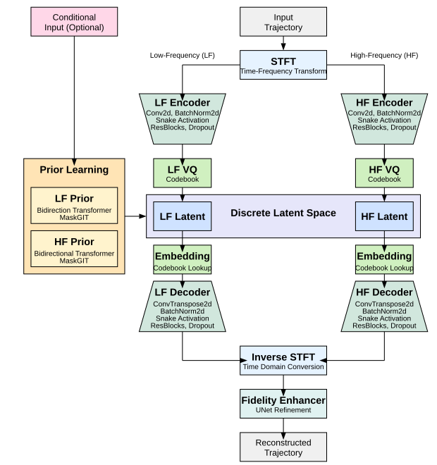
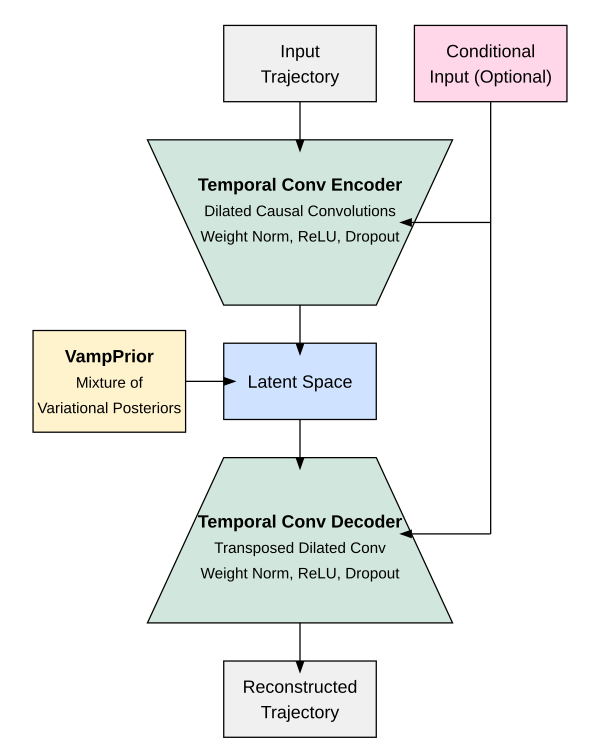

# Time Series Generation

For trajectory data, we adopted specialized models that capture the complex spatiotemporal dynamics of aircraft movements. These models handle both terminal area operations and complete end-to-end flights, leveraging advanced machine learning techniques to generate synthetic aircraft trajectories. To learn more about our research, see our publications: [Synthetic Aircraft Trajectory Generation Using Time-Based VQ-VAE](https://doi.org/10.1109/ICNS65417.2025.10976929) and [Generation of Synthetic Aircraft Landing Trajectories Using Generative Adversarial Networks](https://www.sesarju.eu/sites/default/files/documents/sid/2024/papers/SIDs_2024_paper_054%20final.pdf). Open-source implementations are available in our [trajectory generation repositories](/repositories/repositories.html#time-series-generators). Public deliverables describing the time series generators are currently under evaluation by the SESAR Joint Undertaking and will be made publicly available upon approval.

  
   
  <em><strong>Figure 1: Time Series Generation Pipeline.</strong> Aircraft trajectory data from OpenSky Network and EUROCONTROL, enriched with weather context (ERA5, METAR), feeds into specialized generative models producing synthetic trajectories validated for fidelity, diversity, and domain-specific flyability.</em>

## Model Overview

We have implemented and evaluated five state-of-the-art generative models for synthetic aircraft trajectory generation, each bringing unique strengths to address the complex temporal dependencies and multivariate nature of flight data:

1. **TimeVQVAE** - Time-based Vector Quantized Variational Autoencoder
2. **TCVAE with VampPrior** - Temporal Convolutional Variational Autoencoder  
3. **TimeGAN** - Time-series Generative Adversarial Network
4. **Flow Matching** - Continuous normalizing flow-based trajectory generation
5. **Diffusion Models** - Denoising diffusion probabilistic models for aviation

## TimeVQVAE: Time-based Vector Quantized VAE

TimeVQVAE combines time-frequency domain processing with discrete latent representations and transformer-based priors to capture both global and local dynamics in flight trajectories.

  
   
  <em><strong>Figure 2: TimeVQVAE Architecture.</strong> The model processes trajectories in the time-frequency domain through dual encoding pathways (low-frequency and high-frequency), uses vector quantization for discrete latent representations, and employs transformer-based priors to model temporal dependencies.</em>

### Key Components

**Time-Frequency Transformation**: The model applies Short-Time Fourier Transform (STFT) to convert input trajectories into a time-frequency representation, enabling capture of both global trends (low-frequency) and local patterns (high-frequency).

**Dual Encoding Pathway**: After STFT, trajectories are split into low-frequency (LF) and high-frequency (HF) bands, each processed by separate encoders with convolutional layers and residual blocks.

**Vector Quantization**: Each encoding path uses VQ-VAE techniques to create discrete latent representations through nearest neighbor search in embedding space, providing more stable training and structured representations.

**Transformer Priors**: Bidirectional transformers learn prior distributions over the discrete codes, capturing long-range dependencies essential for coherent trajectory generation.

**Generation Process**: Uses MaskGIT with iterative decoding, starting with fully masked sequences and progressively unmasking tokens based on confidence scores, enabling parallel generation while maintaining global coherence.

## TCVAE with VampPrior

The Temporal Convolutional Variational Autoencoder with Variational Mixture of Posteriors Prior combines VAE learning with temporal convolutional networks and flexible prior distributions.

  
   
  <em><strong>Figure 3: TCVAE Architecture.</strong> The model uses temporal convolutional networks for encoder/decoder with VampPrior for enhanced latent space expressiveness and optional conditional input handling.</em>

### Architecture

**Temporal Convolutional Encoder**: Stacked dilated causal convolutions with increasing receptive fields effectively capture long-range temporal dependencies while maintaining causal structure.

**VampPrior**: Replaces standard Gaussian priors with a mixture of variational posteriors using learnable pseudo-inputs, providing more flexible and data-adaptive prior distributions.

**Conditional Generation**: Supports various conditioning inputs including continuous features, cyclical transformations (sine/cosine for periodicity), and one-hot encoded categorical data.

**Training Objective**: Minimizes Evidence Lower Bound (ELBO) including reconstruction loss and KL divergence between aggregated posterior and VampPrior.

## TimeGAN: Time-series Generative Adversarial Network

TimeGAN employs adversarial training combined with supervised learning to generate realistic time series while preserving temporal relationships.

### Architecture Components

**Four-Network Design**:
- **Embedding Network**: Maps high-dimensional time series to compact latent space using RNN layers
- **Recovery Network**: Reconstructs original data from latent representations  
- **Generator Network**: Produces synthetic latent sequences from random noise
- **Discriminator Network**: Distinguishes real from synthetic sequences

**Multi-Loss Training**:
- **Reconstruction Loss**: Ensures embedding/recovery networks accurately preserve data
- **Supervised Loss**: Maintains step-by-step temporal relationships
- **Adversarial Loss**: Generator aims to fool discriminator while discriminator learns to distinguish real/fake sequences

## Flow Matching Models

Flow Matching (FM) represents a modern approach to generative modeling that offers an alternative to diffusion models for aircraft trajectory generation. These models are based on Continuous Normalizing Flows (CNFs) and provide deterministic, efficient sampling for complex spatiotemporal distributions.

### Latent Flow Matching

**Two-Stage Architecture**: Similar to latent diffusion, Latent Flow Matching (LFM) combines the efficiency of autoencoders with flow-based generation:

1. **Stage 1**: A Temporal Convolutional Variational Autoencoder (TCVAE) encodes trajectories into meaningful latent representations
2. **Stage 2**: Flow Matching operates in the compressed latent space, generating new latent codes that decode into realistic trajectories

**Advantages**: This approach reduces computational requirements while maintaining high-quality generation, particularly beneficial for high-dimensional trajectory data with complex temporal dependencies.

### Architecture

**U-Net Backbone**: The flow matching model employs a U-Net architecture with ResNet blocks for robust gradient flow and skip connections to preserve spatial details across different resolution levels.

**Conditional Generation**: Support for structured conditioning through Wide-and-Deep networks, incorporating:
- Continuous features (e.g., sine/cosine encodings of temporal information)  
- Categorical features (e.g., departure airport, aircraft type)
- Embedding fusion for context-aware trajectory generation

## Diffusion Models

Diffusion models bring the power of denoising diffusion probabilistic models to aircraft trajectory generation, offering state-of-the-art performance for modeling complex spatiotemporal distributions in aviation data.

### Latent Diffusion

**Enhanced Efficiency**: Latent Diffusion Models (LDMs) combine autoencoder compression with diffusion generation, operating in a reduced-dimensional latent space rather than raw trajectory coordinates.

**Dual Training Protocol**:
1. **Autoencoder Training**: A VAE with minimal regularization (low β) learns robust trajectory representations
2. **Diffusion Training**: The diffusion process operates on encoded latent representations, reducing computational overhead

**Quality Benefits**: This approach enables generation of high-fidelity trajectories with faster sampling while maintaining the expressiveness needed for complex flight patterns.

### DiffTraj Adaptation

**Aviation Domain Specialization**: The implementation adapts DiffTraj, originally designed for urban traffic, to aviation-specific requirements including altitude dynamics, airspace constraints, and flight phase transitions.

**U-Net Architecture**: Features encoder-decoder structure with:
- ResNet blocks with Swish activations for effective temporal modeling
- Attention mechanisms at multiple resolutions for feature focusing  
- Skip connections preserving spatial trajectory details
- Embedding blocks for timestep and categorical conditioning

**Conditional Control**: Comprehensive conditioning support enables generation based on departure airports, temporal patterns, and operational constraints, producing contextually appropriate synthetic trajectories.

## Evaluation Framework

Our comprehensive evaluation combines multiple assessment approaches:

### Quality Metrics
- **Fréchet Inception Distance (FID)**: Measures distribution similarity using ROCKET or FCN feature extraction
- **Inception Score (IS)**: Evaluates both realism and diversity of generated samples

### Statistical Metrics  
- **Marginal Distribution Difference (MDD)**: Compares overall statistical characteristics
- **Autocorrelation Difference (ACD)**: Assesses temporal dependency preservation
- **Skewness/Kurtosis Differences**: Capture distribution asymmetries and tail behaviors

### Domain-Specific Assessment
**Flyability Testing**: Generated trajectories are validated in BlueSky air traffic simulator using multiple distance metrics (SSPD, Hausdorff, Fréchet, DTW, etc.) to assess operational feasibility.

### Visual Analysis
Comprehensive visualization includes PCA/t-SNE projections, time series plots, correlation analysis, and geographical trajectory comparisons.
