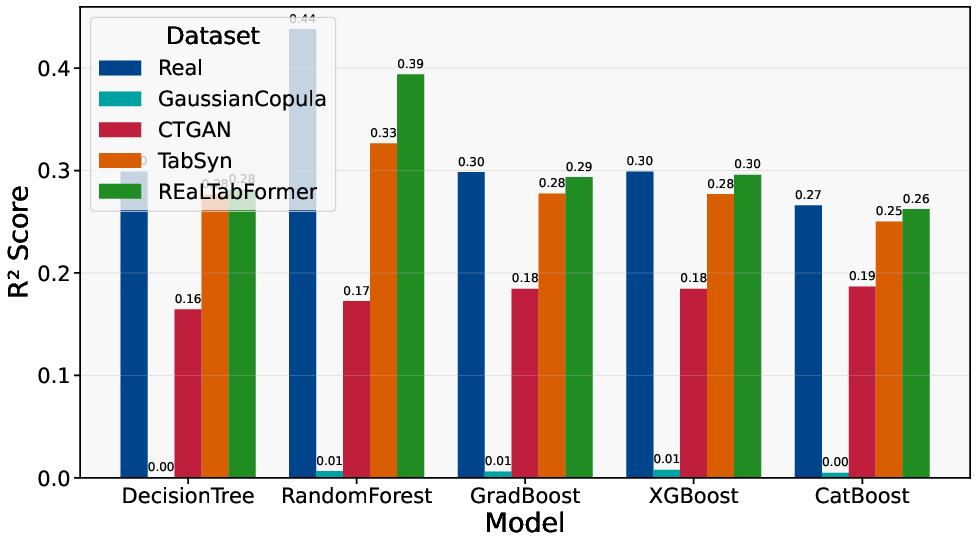
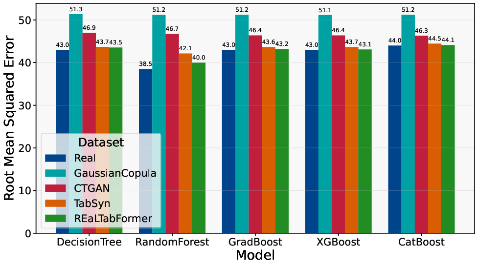
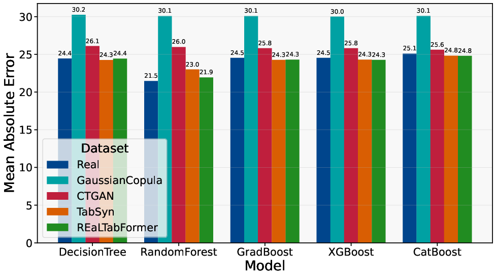
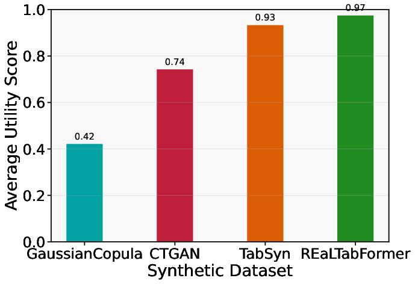
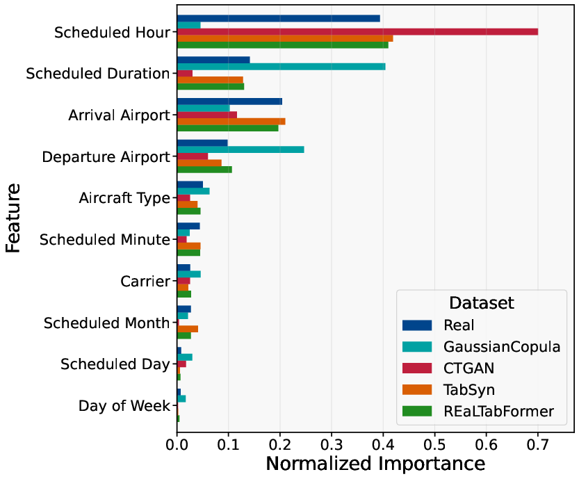
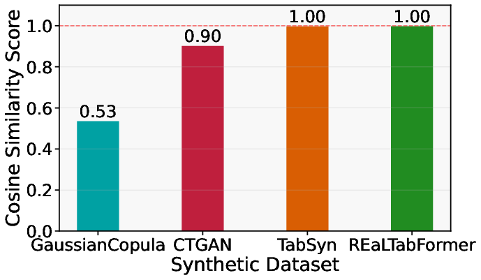

# UC1 - Turnaround Time Prediction

## Overview

Turnaround time prediction represents one of the most operationally critical applications in air traffic management, focusing on forecasting the duration between an aircraft's arrival (In-Block) and subsequent departure (Off-Block). This use case addresses the fundamental challenge of optimizing ground operations while maintaining schedule reliability.

Turnaround operations encompass multiple sequential processes including passenger deplaning, aircraft cleaning, catering, refueling, maintenance checks, passenger boarding, and cargo handling. Each process varies significantly based on aircraft type, airport infrastructure, time of day, and operational conditions. Accurate prediction of these durations is essential for:

- **Gate allocation and resource planning**
- **Crew scheduling optimization** 
- **Delay propagation mitigation**
- **Airport capacity management**
- **Passenger connection planning**

## Operational Context

In pre-tactical scenarios (hours to days before operations), turnaround predictions must rely solely on scheduled information without access to real-time operational data. This constraint makes the prediction particularly challenging as external factors—weather conditions, air traffic congestion, technical issues, and crew availability—remain unknown at schedule publication time.

Despite these limitations, pre-tactical turnaround predictions provide significant value across the aviation ecosystem. Airlines use these forecasts to optimize aircraft assignments and crew schedules before disruptions cascade through their networks. Airports utilize predictions to plan gate requirements and ground handling resource allocation.

## Dataset and Methodology

### Data Sources
The evaluation utilized OAG's Flight Info Direct Status Summary database, covering European flight operations from March, June, September, and December 2019. After filtering for completed flights with full operational timelines and valid turnaround observations, the dataset contained **1,744,667 flight records**.

Key dataset characteristics:
- **Mean turnaround time**: 70.8 minutes (σ=51.2)
- **Turnaround constraint**: ≤ 6 hours (excluding overnight parking)
- **Train-test split**: 80/20 (1,395,733/348,934 flights)

### Feature Engineering
For pre-tactical prediction, only features available at schedule publication time were used:

**Categorical Features:**
- IATA carrier code
- Departure and arrival airports
- Aircraft type

**Temporal Features:**
- Month, day, hour, minute (from scheduled departure)
- Day of week

**Operational Features:**
- Scheduled flight duration

### Target Variable
Turnaround time was computed as the ground time between consecutive flights of the same aircraft at the same airport, mathematically defined as the interval between arrival In-Block Time and departure Off-Block Time.

## Synthetic Data Generation

Four state-of-the-art synthetic data generators were evaluated for their ability to preserve turnaround prediction relationships:

1. **Gaussian Copula**: Statistical modeling approach separating marginal distributions from dependence structure
2. **CTGAN**: Adversarial learning with mode-specific normalization for mixed-type data
3. **TabSyn**: Two-stage approach using VAE with diffusion in latent space
4. **REaLTabFormer**: Transformer architecture treating flight records as token sequences

All generators were trained on real training data and evaluated using the Train on Synthetic, Test on Real (TSTR) methodology to assess their utility for operational prediction.

## Results and Analysis

### Predictive Performance

Turnaround time prediction demonstrated the **highest predictability** among all evaluated operational tasks, with real-data models achieving R² values between **0.27-0.44**. This performance reflects the more deterministic nature of turnaround processes compared to delay propagation, as core ground operations follow predictable patterns based on aircraft characteristics and airport infrastructure.

*Coefficient of determination (R²) for pre-tactical turnaround time prediction across different models and synthetic data generators*

### Error Metrics Analysis

The analysis revealed pronounced performance differences between synthetic generators:

*Prediction error metrics (RMSE and MAE) for pre-tactical turnaround time across models and synthetic data generators*

**Key findings:**
- **REaLTabFormer** achieved RMSE values within 3% of real-data baselines
- **TabSyn** followed closely with competitive performance
- **CTGAN** showed moderate degradation
- **Gaussian Copula** exhibited substantial performance gaps

### Utility Score Assessment

The utility score analysis confirmed turnaround prediction as a **successful application** of synthetic data:

*Average utility scores for pre-tactical turnaround time prediction across synthetic data generators*

**Performance hierarchy:**
- **REaLTabFormer**: 0.97 utility score (97% of real-data performance)
- **TabSyn**: 0.93 utility score
- **CTGAN**: Moderate utility retention
- **Gaussian Copula**: Lowest utility preservation

These high utility scores indicate that synthetic data can serve as an **effective substitute** for proprietary operational records in turnaround planning applications.

### Feature Importance Analysis

Feature importance analysis revealed the dominant predictive factors across all data sources:

*Feature importance comparison for pre-tactical turnaround time prediction averaged across all models*

**Key operational drivers:**
- **Scheduled hour/Duration**: Primary predictor capturing time-of-day variations
- **Airport identifiers**: Significant influence reflecting infrastructure differences
- **Aircraft type**: Important for process duration estimation
- **Carrier effects**: Operational procedure variations

This pattern aligns with operational knowledge, as turnaround processes exhibit significant time-of-day variations due to staffing levels, gate availability, and passenger flow patterns.

### Feature Alignment Preservation

The analysis of feature importance alignment demonstrates how well synthetic data preserves operational relationships:

*Average feature importance alignment scores for pre-tactical turnaround time prediction*

**Finding**: REaLTabFormer and TabSyn achieved **perfect alignment scores (1.00)**, ensuring that models trained on their synthetic data identify the same operational drivers as real-data models. This preservation of causal relationships is crucial for operational applications where understanding which factors drive turnaround variations is as important as prediction accuracy.

## Operational Implications

### Planning Applications
The high utility scores (95-97%) achieved by advanced generators indicate that synthetic data can effectively support critical pre-tactical decisions including:
- **Gate allocation optimization**
- **Ground crew scheduling**
- **Resource planning and allocation**
- **Delay mitigation strategies**

### Realistic Expectation Management

Synthetic data generation enables broader access to analytics capabilities across the aviation industry. Organizations without access to comprehensive historical datasets can develop turnaround prediction models using synthetic data, potentially accelerating innovation in aviation operations.

While synthetic data shows strong utility, the inherent R² ceiling (≤0.44) highlights fundamental uncertainties in pre-tactical prediction. Organizations should design planning processes that accommodate this uncertainty through buffers and contingency mechanisms rather than expecting precise forecasts.

### Implementation Considerations

1. **Data Quality**: Ensure synthetic data undergoes comprehensive fidelity assessment before operational deployment
2. **Feature Preservation**: Verify that chosen generators maintain operational relationship patterns critical for decision-making
3. **Performance Monitoring**: Continuously evaluate synthetic-trained models against real operational outcomes
4. **Uncertainty Quantification**: Incorporate prediction uncertainty into operational planning processes

## Conclusion

UC1 demonstrates that **turnaround time prediction represents a successful application of synthetic data** in pre-tactical aviation scenarios. With utility scores reaching 97% of real-data performance, synthetic data enables organizations to develop operational prediction capabilities without requiring access to sensitive proprietary records.

The consistent performance hierarchy across generators provides clear guidance for implementation, while the preservation of operational relationships ensures that synthetic-trained models identify the same causal factors as real-data approaches. However, stakeholders must maintain realistic expectations about prediction accuracy given the inherent stochasticity of aviation operations, designing robust planning processes that accommodate operational uncertainty.

These findings suggest potential for democratizing aviation analytics capabilities while maintaining commercial confidentiality, enabling broader innovation in turnaround optimization and ground operations management.