# UC2 - Flight Delay Prediction

## Overview

Pre-tactical flight delay prediction represents one of the most challenging applications in aviation operations, focusing on forecasting both departure and arrival delays hours to days before scheduled operations using only published schedule information. This use case addresses the fundamental challenge of anticipating disruptions when external factors—weather conditions, air traffic congestion, technical issues, and crew availability—remain unknown at schedule publication time.

Flight delays cascade through aviation networks, affecting passengers, crew schedules, aircraft rotations, and airport operations. Early detection of potential delays enables proactive decision-making across the aviation ecosystem. Airlines can adjust operations by modifying aircraft assignments, crew schedules, or flight times before disruptions propagate through their networks. Airports utilize predictions to optimize staffing levels, gate assignments, and ground handling resources based on anticipated delay patterns.

The operational value of pre-tactical delay prediction includes:

- **Proactive delay mitigation strategies**
- **Optimized crew scheduling and resource allocation** 
- **Enhanced passenger experience through early notifications**
- **Improved network flow management**
- **Strategic gate and airport capacity planning**

## Operational Context

Pre-tactical delay prediction operates in a fundamentally constrained information environment. Unlike tactical models that incorporate real-time updates including weather conditions, air traffic flow restrictions, and current aircraft positions, pre-tactical predictions must rely primarily on scheduled characteristics and historical patterns. This temporal distance from operations creates substantial uncertainty but remains operationally valuable for strategic planning decisions.

The challenge stems from the numerous factors that influence actual departure times but remain unknown at schedule publication. Weather patterns, air traffic congestion, technical failures, crew availability, airport capacity constraints, and cascading delays from earlier flights all contribute to deviations from scheduled operations. Despite these limitations, pre-tactical forecasts provide crucial lead time for operational adjustments and passenger notifications.

The aviation industry's restricted data access compounds these technical challenges. Airlines typically guard operational data as commercially sensitive, limiting the development of predictive models for organizations without comprehensive historical datasets. This creates barriers for smaller operators, regional airports, and researchers seeking to develop delay prediction capabilities.

## Dataset and Methodology

### Data Sources
The evaluation utilized OAG's Flight Info Direct Status Summary database, covering European flight operations from March, June, September, and December 2019. After filtering for completed flights with full operational timelines, the dataset contained **1,744,667 flight records** with complete departure delay observations.

Key dataset characteristics:
- **Mean departure delay**: 11.1 minutes (σ=24.0)
- **Mean arrival delay**: 7.5 minutes (σ=25.8)
- **Delay constraint**: Focus on operational delays affecting network flow
- **Train-test split**: 80/20 (1,395,733/348,934 flights)

### Feature Engineering
For pre-tactical prediction, only features available at schedule publication time were utilized:

**Categorical Features:**
- IATA carrier code
- Departure and arrival airports
- Aircraft type

**Temporal Features:**
- Month, day, hour, minute (from scheduled departure)
- Day of week

**Operational Features:**
- Scheduled flight duration

### Target Variables
Two complementary delay metrics were computed:
- **Departure delay**: Δ_dep = t_AOBT - t_SOBT (Actual vs. Scheduled Off-Block Time)
- **Arrival delay**: Δ_arr = t_AIBT - t_SIBT (Actual vs. Scheduled In-Block Time)

Positive values indicate delays while negative values represent early operations.

## Synthetic Data Generation

Four state-of-the-art synthetic data generators were evaluated for their ability to preserve both departure and arrival delay prediction relationships:

1. **Gaussian Copula**: Statistical modeling approach separating marginal distributions from dependence structure
2. **CTGAN**: Adversarial learning with mode-specific normalization for mixed-type data
3. **TabSyn**: Two-stage approach using VAE with diffusion in latent space
4. **REaLTabFormer**: Transformer architecture treating flight records as token sequences

All generators were trained on real training data and evaluated using the Train on Synthetic, Test on Real (TSTR) methodology to assess their utility for operational prediction.

## Results and Analysis

This evaluation encompasses two complementary delay prediction tasks: departure delay prediction focusing on ground operations and scheduling factors, and arrival delay prediction incorporating the cumulative effects of departure delays plus en-route uncertainties.

## Departure Delay Prediction

### Predictive Performance

Pre-tactical departure delay prediction emerged as one of the most challenging tasks, with real-data models achieving R² values between **0.10-0.30**. This limited predictability reflects the numerous external factors influencing departure times that are not captured in scheduled information alone—weather conditions, air traffic flow restrictions, crew availability, and technical issues create fundamental uncertainty in pre-tactical scenarios.

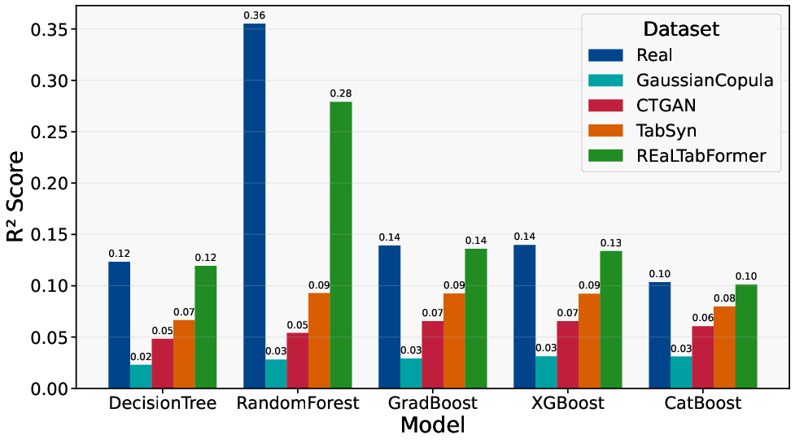
*Coefficient of determination (R²) for pre-tactical departure delay prediction across different models and synthetic data generators*

Despite these inherent constraints, clear performance hierarchies emerged among synthetic generators, with REaLTabFormer consistently demonstrating ability to preserve the subtle predictive patterns present in scheduled data.

### Error Metrics Analysis

The analysis revealed pronounced performance differences between synthetic generators in their ability to maintain predictive relationships:

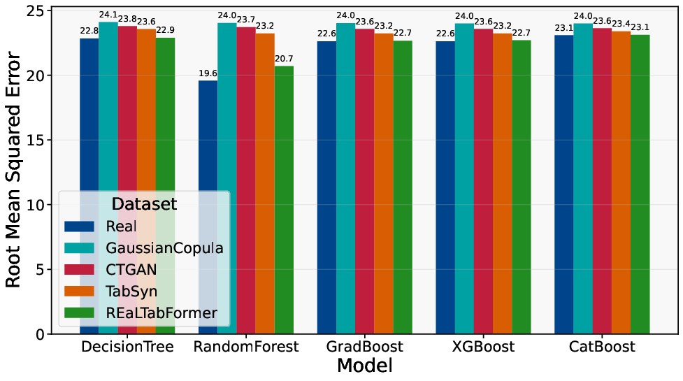

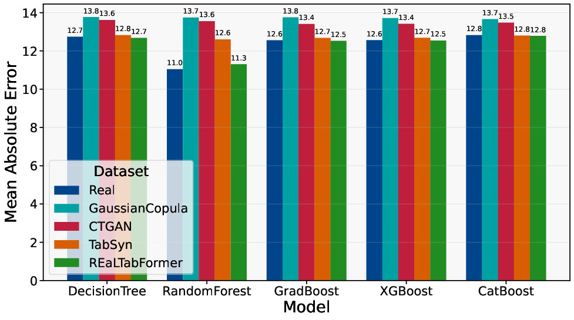
*Prediction error metrics (RMSE and MAE) for pre-tactical departure delay across models and synthetic data generators*

**Key findings:**
- **REaLTabFormer** achieved RMSE values within 4% of real-data baselines
- **TabSyn** showed moderate performance with acceptable degradation
- **CTGAN** exhibited noticeable performance gaps
- **Gaussian Copula** demonstrated substantial performance deterioration

The transformer architecture's advantage becomes particularly evident in this challenging scenario where capturing subtle interactions between categorical features (airlines, airports) and temporal patterns proves crucial for delay prediction.

### Utility Score Assessment

The utility score analysis quantifies the practical impact of substituting synthetic for real training data:

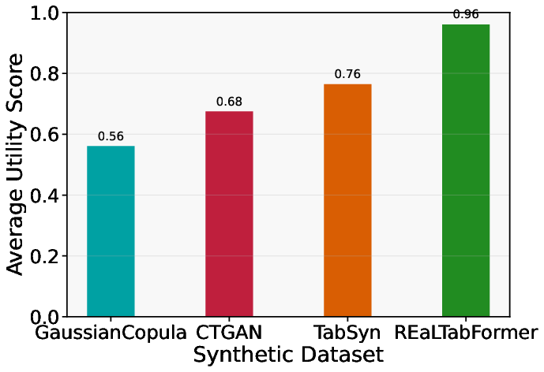
*Average utility scores for pre-tactical departure delay prediction across synthetic data generators*

**Performance hierarchy:**
- **REaLTabFormer**: 0.96 utility score (96% of real-data performance)
- **TabSyn**: 0.76 utility score
- **CTGAN**: Moderate utility retention
- **Gaussian Copula**: Lowest utility preservation

REaLTabFormer's 96% utility score indicates that models trained on its synthetic data retain nearly all predictive capability of real-data models, representing strong preservation of predictive relationships despite the task's inherent difficulty.

### Feature Importance Analysis

Feature importance analysis reveals the dominant predictive factors for pre-tactical departure delay prediction:

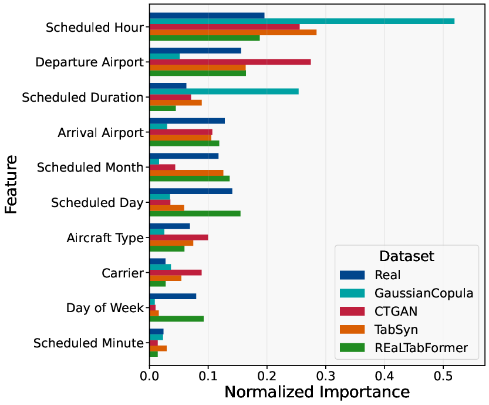
*Feature importance comparison for pre-tactical departure delay prediction averaged across all models*

**Key operational drivers:**
- **Scheduled hour**: Primary predictor capturing time-of-day variations in operational complexity
- **Airport identifiers**: Significant influence reflecting infrastructure differences and congestion patterns
- **Carrier effects**: Operational procedure variations between airlines
- **Temporal patterns**: Day-of-week and seasonal effects on delay propensity

This pattern aligns with operational knowledge, as departure delays exhibit strong time-of-day variations due to:
- Morning peak congestion and cumulative scheduling pressure
- Midday operational lulls with reduced delay propagation
- Evening cascade effects where early delays propagate through networks
- Airport-specific infrastructure constraints and operational procedures

### Feature Alignment Preservation

The analysis of feature importance alignment demonstrates how well synthetic data preserves operational relationships:

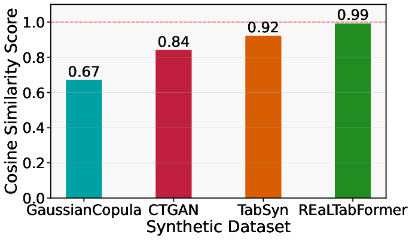
*Average feature importance alignment scores for pre-tactical departure delay prediction*

**Findings**: REaLTabFormer maintained near-perfect alignment (0.99), ensuring that models trained on its synthetic data identify the same operational drivers as real-data models. This preservation of causal relationships proves crucial for operational deployment, where understanding which factors drive delay patterns guides resource allocation and operational improvement decisions.

In contrast, simpler methods showed progressive alignment degradation, with Gaussian Copula's alignment dropping to 0.67, potentially leading to incorrect operational conclusions about delay causation.

## Arrival Delay Prediction

### Predictive Performance

Pre-tactical arrival delay prediction proved to be the most challenging task among all evaluated scenarios, with real-data R² values rarely exceeding **0.30**. This represents the cumulative uncertainty of multiple operational phases: ground operations affecting departure timing, en-route factors including air traffic congestion and weather, and destination airport conditions. The complexity of predicting arrival delays hours in advance using only scheduled information highlights fundamental limitations in aviation predictability.

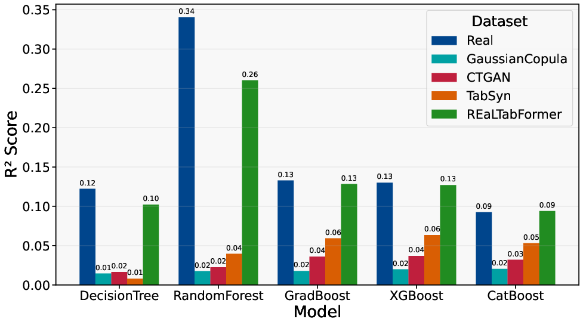
*Coefficient of determination (R²) for pre-tactical arrival delay prediction across different models and synthetic data generators*

The inherently lower predictability of arrival delays compared to departure delays reflects the compounding uncertainties that accumulate throughout the flight lifecycle, making this task particularly dependent on sophisticated modeling approaches.

### Error Metrics Analysis

Despite the increased task complexity, synthetic data generators maintained their relative performance hierarchy:

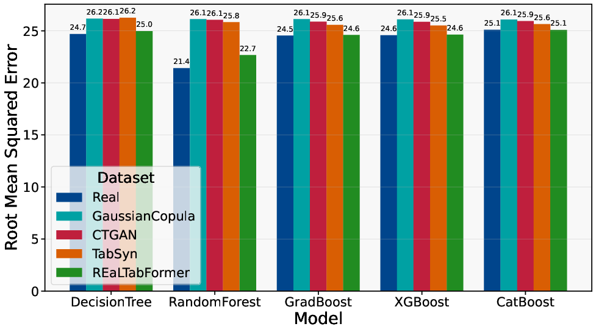

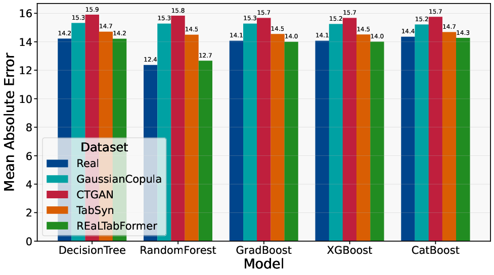
*Prediction error metrics (RMSE and MAE) for pre-tactical arrival delay across models and synthetic data generators*

**Key findings:**
- **REaLTabFormer** continued to achieve the lowest error rates, demonstrating robustness across different prediction scenarios
- **TabSyn** maintained competitive performance despite increased complexity
- The **transformer** architecture's advantage becomes more pronounced in complex scenarios requiring subtle feature interactions
- **Gaussian Copula** struggled significantly with the multifaceted nature of arrival delay causation

### Utility Score Assessment

Despite the increased task complexity, REaLTabFormer maintained strong utility performance:

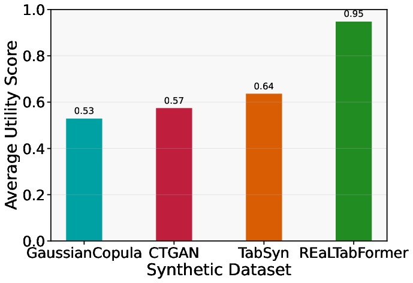
*Average utility scores for pre-tactical arrival delay prediction across synthetic data generators*

**Performance results:**
- **REaLTabFormer**: 0.95 utility score (95% of real-data performance)
- **TabSyn**: Moderate utility retention with acceptable degradation
- **CTGAN**: Noticeable performance impact under increased complexity
- **Gaussian Copula**: Substantial utility loss in complex prediction scenarios

The consistent high performance demonstrates REaLTabFormer's ability to capture the underlying statistical structure that relates scheduled flight information to eventual arrival performance, even when that relationship becomes increasingly attenuated by intervening factors.

### Feature Importance Analysis

Feature importance analysis for arrival delays revealed a slightly different pattern than departure delay prediction:

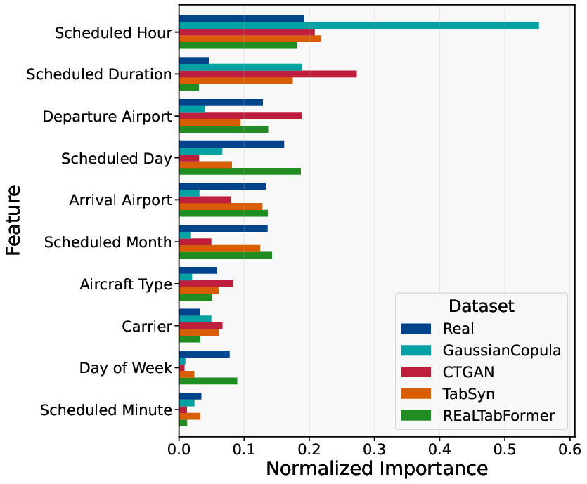
*Feature importance comparison for pre-tactical arrival delay prediction averaged across all models*

**Key operational drivers:**
- **Scheduled flight duration**: Emerged as an additional significant predictor, reflecting that longer flights have more opportunities for en-route delays and recovery
- **Scheduled hour**: Continued importance due to air traffic congestion patterns
- **Airport identifiers**: Critical for both departure and destination airport characteristics
- **Temporal patterns**: Day-of-week and seasonal effects on arrival delay propensity

The distribution of importance across multiple features indicates that arrival delay prediction requires modeling interactions between temporal, spatial, and operational characteristics simultaneously.

### Feature Alignment Preservation

Feature alignment scores maintained the established pattern across the more complex arrival delay task:

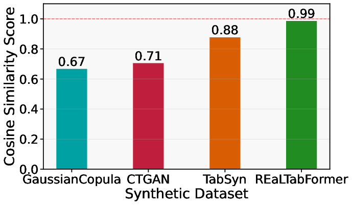
*Average feature importance alignment scores for pre-tactical arrival delay prediction*

**Findings**: REaLTabFormer achieved near-perfect alignment (0.99) while simpler methods showed progressive degradation. This consistency in feature relationship preservation across increasingly difficult tasks demonstrates REaLTabFormer's fundamental advantage in capturing the complex dependencies present in aviation operational data.

## Operational Implications

### Planning Applications
The high utility scores (95-96%) achieved by REaLTabFormer across both delay types indicate that synthetic data can effectively support critical pre-tactical decisions including:
- **Proactive delay mitigation strategies** for both departure and arrival operations
- **Crew scheduling optimization** based on anticipated delay patterns
- **Gate allocation adjustments** for expected late arrivals and extended turnarounds
- **Passenger notification and connection management** using arrival delay forecasts
- **Network flow optimization** incorporating both departure and arrival delay predictions
- **Airport capacity planning** based on anticipated operational disruptions

### Democratizing Analytics Capabilities
Synthetic data generation enables broader access to comprehensive delay prediction capabilities across the aviation industry. Organizations without access to comprehensive historical datasets can develop both departure and arrival delay models using synthetic data, potentially accelerating innovation in aviation operations and delay management strategies.

### Realistic Expectation Management
The modest R² values (≤0.30) achieved even with real data highlight fundamental uncertainties in pre-tactical delay prediction. This establishes realistic baselines for any predictive system regardless of data source. Organizations should design planning processes that accommodate this uncertainty through:
- Robust buffer mechanisms rather than precise forecasts
- Probabilistic decision-making frameworks
- Contingency planning for high-uncertainty scenarios
- Gradual confidence building as operations approach

### Implementation Considerations

1. **Data Quality**: Ensure synthetic data undergoes comprehensive fidelity assessment before operational deployment
2. **Feature Preservation**: Verify that chosen generators maintain operational relationship patterns critical for delay management
3. **Performance Monitoring**: Continuously evaluate synthetic-trained models against real operational outcomes
4. **Uncertainty Quantification**: Incorporate prediction uncertainty into operational planning processes rather than relying on point estimates

## Conclusion

UC2 demonstrates that **both departure and arrival delay prediction represent challenging but viable applications of synthetic data** in pre-tactical aviation scenarios. With REaLTabFormer achieving 95-96% utility compared to real-data performance across both delay types, synthetic data enables organizations to develop comprehensive delay prediction capabilities without requiring access to sensitive proprietary operational records.

The evaluation reveals key operational insights:
- Departure delay prediction (R² ≤ 0.30) focuses on ground operations and scheduling factors
- Arrival delay prediction (R² ≤ 0.30) incorporates cumulative uncertainties from departure delays plus en-route factors
- Feature relationships differ between delay types, with flight duration becoming more important for arrival delays
- Utility preservation remains consistently high (95-96%) across both prediction tasks

The consistent performance hierarchy across generators provides clear guidance for implementation, while the preservation of operational relationships ensures that synthetic-trained models identify the same causal factors as real-data approaches. However, stakeholders must maintain realistic expectations about prediction accuracy given the inherent stochasticity of aviation operations and the limited information available in pre-tactical timeframes.

These findings suggest potential for democratizing aviation analytics capabilities while maintaining commercial confidentiality, enabling broader innovation in comprehensive delay prediction and proactive disruption management. The moderate but meaningful predictive power should inform robust planning processes that accommodate operational uncertainty while leveraging available predictive insights for strategic advantage across both departure and arrival operations.