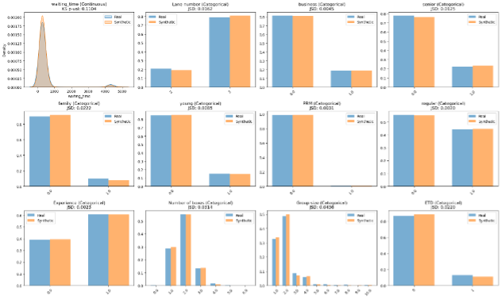

# UC3 - Passenger Flow Prediction

## Overview

Passenger flow prediction addresses forecasting passenger movement throughout airport terminals. This use case focuses on waiting times at security checkpoints—a significant bottleneck in the passenger flow process. However, passenger flow data is typically restricted due to privacy and commercial concerns.

We evaluate synthetic data generation for security checkpoint waiting time prediction using limited real-world data from Rotterdam airport.

## Operational Context

Security checkpoints directly impact passenger experience and airport efficiency. Waiting times are key stress factors that influence passenger satisfaction and overall airport operations.

Passenger flow modeling typically requires extensive data collection, but the sensitive nature of this data limits access for research and model development.

## Dataset and Methodology

### Data Source and Limitations

The evaluation utilized security checkpoint data from Rotterdam The Hague Airport (RTM), collected by [**Janssen et al.**](https://www.mdpi.com/2226-4310/7/6/69) This dataset comprises **2,277 passengers** processed through **13 different security checkpoint lanes** across **11 time blocks** between February and December 2018.

**Key dataset characteristics:**
- Detailed timing information for each security process stage
- Passenger type classifications (business, senior, family, young, reduced mobility, regular)
- Lane configuration data and processing conditions
- Complete journey timestamps from baggage drop-off to reclaim

**Limitation:** Using data from a single airport limits generalizability. Despite outreach to multiple airports and aviation projects, passenger flow data remains restricted due to privacy and commercial concerns.

The methodology can be applied to other airport datasets when available, but Rotterdam's unique procedures and layout constrain direct transferability.

### Feature Engineering

The prediction task focused on forecasting total waiting time at security checkpoints, defined as the complete duration from baggage drop-off start to baggage reclaim end. Input features included:

**Passenger Characteristics:**
- Passenger type (business, senior, family, young, PRM, regular)
- Experience level with security procedures
- Group size and number of luggage boxes

**Operational Features:**
- Security lane number
- ETD (Explosive Trace Detection) check requirement
- Time block and lane configuration

### Target Variable

Total waiting time was computed as the complete security checkpoint processing duration, representing the most operationally relevant metric for passenger experience and resource planning.

## Synthetic Data Generation

A **Tabular Variational Autoencoder (TVAE)** was used for synthetic data generation due to the limited dataset size and mixed-type nature of the data. TVAE can capture feature distributions and interdependencies in smaller tabular datasets.

The model was trained using the SDV library for 10,000 epochs on the passenger dataset.

## Results and Analysis

### Data Fidelity Assessment

TVAE captured the general patterns in the original dataset across categorical and continuous variables.

*Distribution comparison between real (blue) and synthetic (orange) data across key passenger flow features*

The synthetic data maintained distribution shapes for passenger types, lane configurations, and waiting times.

### Predictive Performance Analysis

Waiting times showed uniform patterns across passenger categories and processing conditions, limiting the predictive power of available features.

**Performance Results:**

| Experiment | Dataset | MSE | RMSE | MAE | R² |
|------------|---------|-----|------|-----|-----|
| **Equal Volume** | Real Only | 796,349 | 892.4 | 377.9 | -0.168 |
| | Synthetic Only | 687,258 | 829.0 | 324.8 | -0.008 |
| | Real + Synthetic | 706,264 | 840.4 | 342.6 | -0.036 |
| **Enhanced Volume** | Real Only | 796,349 | 892.4 | 377.9 | -0.168 |
| | Synthetic Only (100×) | 587,651 | 766.6 | 283.4 | **0.138** |
| | Real + Synthetic (100×) | 588,172 | 766.9 | 283.9 | **0.137** |

*Regression performance metrics for security checkpoint waiting time prediction*

### Key Findings

1. **Limited Baseline Predictability**: Real-data models achieved negative R² values, indicating that waiting time patterns in the Rotterdam dataset were not well explained by the available features.

2. **Synthetic Data Advantage**: Models trained exclusively on synthetic data outperformed real-data baselines, suggesting that TVAE captured latent relationships not immediately apparent in the original dataset.

3. **Scale Benefits**: Leveraging synthetic data generation's scalability (100× data volume) achieved the first positive R² values (0.138), demonstrating meaningful explanatory power for waiting time variability.

4. **Operational Insight**: The relatively uniform waiting times across passenger categories and processing conditions suggest that security checkpoint efficiency depends more on systemic factors than individual passenger characteristics.

## Operational Implications

This represents a proof-of-concept rather than a comprehensive solution. The Rotterdam dataset's limitations—single airport, security checkpoints only—constrain operational applicability.

Synthetic data generation showed value through data augmentation and improved model performance when scaled up 100×, achieving the first positive R² values (0.138).

## Conclusion

UC3 shows a limited approach to passenger flow prediction using synthetic data. The Rotterdam dataset constrains operational utility, but TVAE methodology could transfer to more comprehensive datasets when available.

Synthetic data augmentation achieved positive R² values (0.138), representing progress over baseline approaches. The methodology provides a foundation for future development when broader passenger flow datasets become accessible.