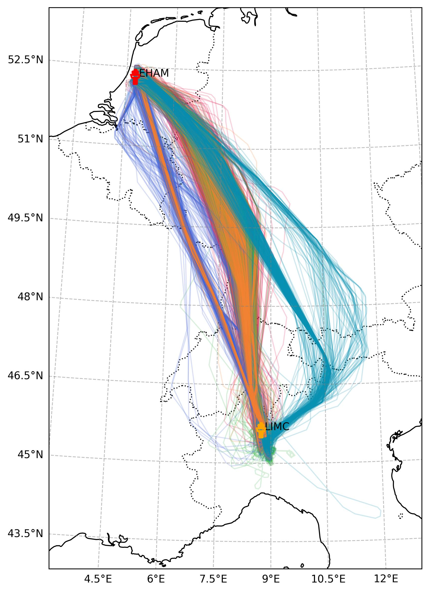
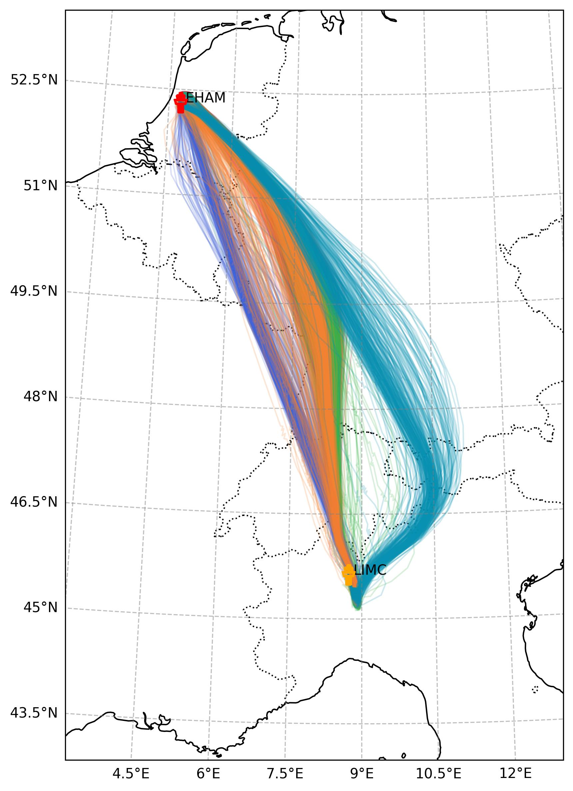
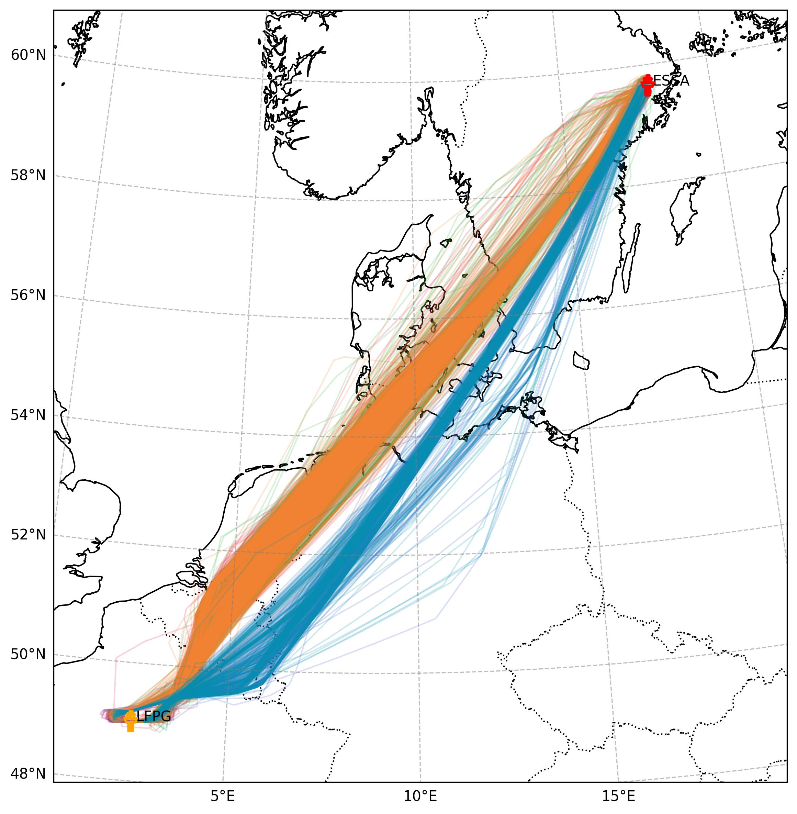
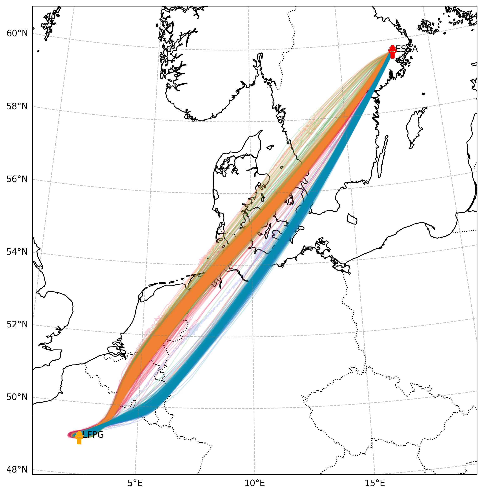
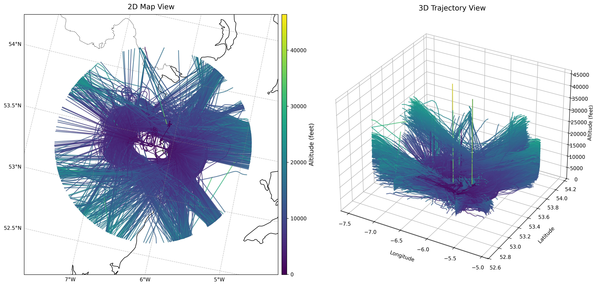
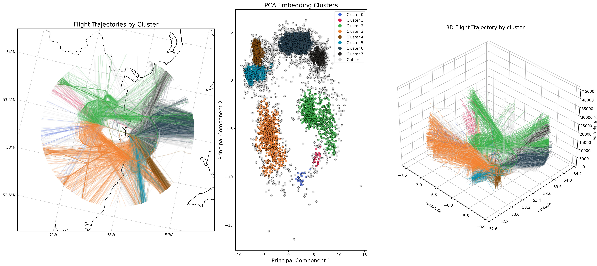
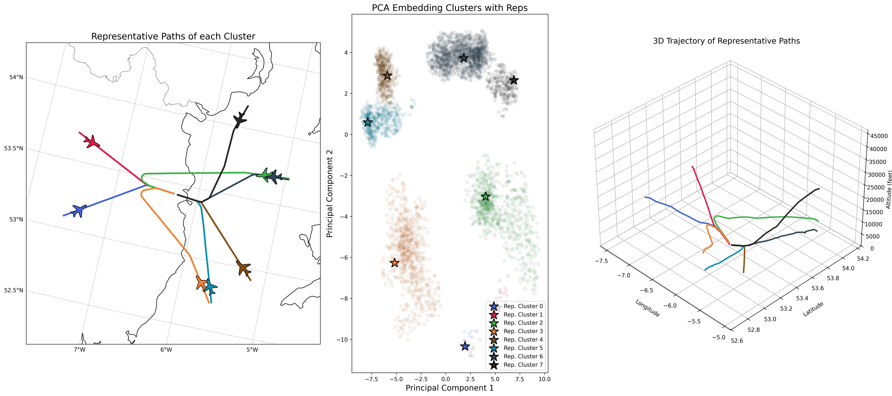
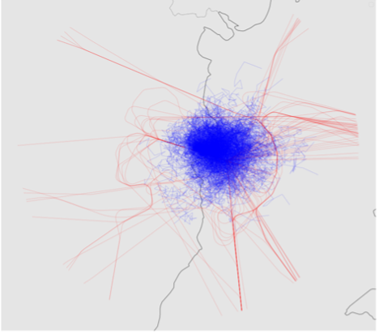
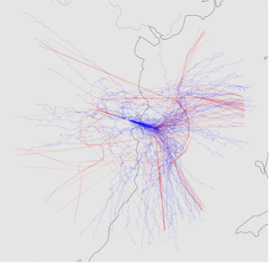

# UC4 - Synthetic Traffic Generator

## Overview

Synthetic aircraft trajectory generation addresses critical challenges in Air Traffic Management (ATM) including data scarcity, and the need for large-scale simulation datasets. This use case demonstrates how advanced deep learning models can generate realistic synthetic flight trajectories that preserve both spatial and temporal characteristics of real air traffic patterns, enabling broader access to flight data for research, training, and operational analysis.

The ability to generate realistic synthetic trajectories has transformative implications for the aviation industry. Researchers can create benchmark datasets for algorithm evaluation, and simulation environments can be populated with diverse, realistic traffic scenarios. 

## Operational Context

As air traffic continues to grow in complexity and volume, there is an increasing need for advanced tools to model and analyze flight operations. Data-driven research in Air Traffic Management (ATM) often requires large amounts of historical flight data. However, obtaining sufficiently comprehensive datasets remains challenging due to data accessibility restrictions and the relative scarcity of certain flight scenarios.

The primary challenges driving synthetic trajectory generation include:

- **Data scarcity**: Limited access to comprehensive historical flight data for certain scenarios or routes
- **Dataset augmentation**: Need for additional flight data to augment machine learning models and conduct broader airspace analyses
- **Scenario underrepresentation**: Certain operational conditions—such as specific weather patterns, emergency diversions, or rare flight scenarios—may be insufficiently represented in available datasets
- **Research accessibility**: Academic and research institutions often lack access to comprehensive operational flight databases
- **Simulation requirements**: Large-scale airspace studies and capacity analyses require diverse, realistic trajectory datasets

Synthetic trajectory generation addresses these challenges by producing additional flight data that exhibits the complex spatiotemporal structures found in real flight trajectories. The approach leverages deep learning architectures to automatically extract and reproduce flight patterns directly from historical data, capturing long-range dependencies and maintaining consistency throughout entire flight paths.

The fundamental challenge lies in generating trajectories that preserve both the statistical characteristics of real flight data and the physical constraints inherent in aircraft operations—including realistic speed profiles, altitude progressions, and adherence to air traffic procedures.

## Dataset

### Trajectory Data Sources
The trajectory datasets used in UC4 come from two complementary sources providing comprehensive flight trajectory information across European airspace:

**OpenSky Network Data** provides high-resolution aircraft position reports collected through ADS-B receivers, including:
- **Spatial coordinates**: Latitude, longitude, altitude with high precision
- **Temporal information**: Timestamps with second-level precision  
- **Aircraft identifiers**: ICAO24 address, callsign for flight tracking
- **High temporal resolution**: Often 1-5 seconds between consecutive points, capturing detailed flight dynamics and maneuvers
- **Coverage period**: Flights from 2019 to 2023 across European airspace

**EUROCONTROL R&D Archive** complements OpenSky with officially recorded flight plans and actual flight data:
- **Flight identifiers and metadata**: ECTRL ID, aircraft type, operator information
- **Waypoint-based trajectory information**: Latitude, longitude, flight level at key points
- **Origin-destination information**: ADEP and ADES airport codes
- **Broader coverage**: European airspace with lower sampling rates, typically at flight plan waypoints

### Dataset Types and Structure

Two distinct trajectory dataset types were created to support different aspects of synthetic traffic generation:

**End-to-End Flight Trajectories**: Complete paths from departure to arrival airports, capturing entire flight profiles including:
- **Climb phase**: Takeoff through initial cruise altitude
- **Cruise phase**: Level flight at optimal altitude 
- **Descent phase**: Approach and landing procedures
- **Complete spatial-temporal coverage**: Full flight envelope representation

**Landing Trajectories**: Focused on approach and landing phases, covering:
- **Final approach segments**: Typically within 40-100 nautical miles of destination
- **Terminal maneuvering area operations**: Including holding patterns, approach procedures
- **High-resolution terminal dynamics**: Detailed capture of critical flight phases

## Results and Analysis

### Trajectory Visualization and Comparison

#### Amsterdam (EHAM) to Milan (LIMC) Route

<table>
  <tr>
    <td width="50%">
      
      
<em>Real Trajectories</em>

    </td>
    <td width="50%">
      
      
<em>Synthetic Trajectories</em>

    </td>
  </tr>
</table>

*Real flight trajectories (left) showing natural route variations and operational diversity compared with synthetic trajectories (right) capturing primary route corridors while maintaining realistic operational variations*

#### Stockholm (ESSA) to Paris (LFPG) Route

<table>
  <tr>
    <td width="50%">
      
      
<em>Real Trajectories</em>

    </td>
    <td width="50%">
      
      
<em>Synthetic Trajectories</em>

    </td>
  </tr>
</table>

*Cross-route validation demonstrating model generalization across different European corridors*

The synthetic trajectories successfully reproduce:
- **Primary route corridors** following established air traffic flows
- **Altitude profile diversity** reflecting different aircraft types and operational procedures
- **Spatial variation patterns** consistent with air traffic control routing practices
- **Class-conditional generation** enabling targeted trajectory synthesis for specific operational scenarios

## Trajectory Clustering and Pattern Discovery

### Dublin Airport Landing Trajectories

Dublin Airport (EIDW) provides an excellent demonstration of embedding-based trajectory clustering methodology due to its traffic volume and diverse approach patterns. Using TCVAE embeddings, we can automatically discover distinct operational patterns and identify anomalous flight behaviors.

#### Raw Landing Trajectories

*Raw flight trajectories into Dublin Airport showing natural operational diversity across multiple approach corridors*

#### HDBSCAN Clustering Results

*Hierarchical density-based clustering revealing seven distinct approach patterns corresponding to main arrival corridors at Dublin Airport*

#### Anomaly Detection Results

*HDBSCAN's density-based noise detection flags trajectories that deviate from common patterns, indicating potential operational anomalies (shown in grey)*

#### Representative Trajectory Clusters

*Clustering results with representative trajectories highlighting the medoid flight path for each identified approach pattern*

### Key Clustering Insights

The embedding-based trajectory clustering pipeline offers several advantages:

**Dimensionality Reduction**: Compresses complex multivariate trajectories into compact 64-dimensional vectors while preserving essential spatiotemporal patterns

**Automated Feature Learning**: Captures salient flight characteristics without manual engineering of trajectory features

**Noise Robustness**: Filters minor sampling irregularities and measurement noise that could affect traditional clustering approaches

**Flexible Cluster Discovery**: Identifies arbitrarily shaped approach patterns and automatically flags anomalous trajectories

**Operational Pattern Recognition**: Reveals approach corridors, descent procedures, and operational variations that correspond to real air traffic management practices

## Transfer Learning Applications

Transfer learning represents a critical capability for extending trajectory generation to airports or routes with limited historical data. The evaluation demonstrates successful knowledge transfer between different operational contexts.

### Performance Comparison with 5% Target Data

<table>
  <tr>
    <td width="50%">
      
      
<em>No Pretraining (5% Data)</em>

    </td>
    <td width="50%">
      
      
<em>With Transfer Learning (5% Data)</em>

    </td>
  </tr>
</table>

*Comparison showing dramatic improvement in trajectory quality when using transfer learning with only 5% of target airport data*

### Performance Comparison with 20% Target Data

<table>
  <tr>
    <td width="50%">
      
      
<em>No Pretraining (20% Data)</em>

    </td>
    <td width="50%">
      
      
<em>With Transfer Learning (20% Data)</em>

    </td>
  </tr>
</table>

*Enhanced trajectory quality comparison demonstrating sustained transfer learning benefits even with increased target data availability*

**Key transfer learning findings:**
- **Dramatic improvement** in trajectory quality with minimal target airport data
- **Knowledge preservation** of general flight dynamics across different operational contexts
- **Data efficiency** enabling high-quality generation with as little as 5-20% of full datasets
- **Operational applicability** for airports or routes with limited historical trajectory data

The transfer learning results demonstrate particular value for:
- **Regional airports** with sparse historical data
- **New routes** requiring trajectory modeling before substantial operational history
- **Seasonal operations** where limited data periods need augmentation
- **Emergency scenarios** where rare operational patterns require synthetic enhancement

## Operational Implications

### Simulation and Training Applications
The synthetic trajectories enable comprehensive simulation environments for:
- **Air traffic controller training** using realistic but synthetic traffic scenarios
- **Algorithm development** with diverse trajectory patterns for robust testing  
- **Capacity analysis** through synthetic traffic generation at various density levels
- **Safety assessment** using generated edge-case scenarios for evaluation

### Data Augmentation for Machine Learning  
Generated trajectories provide valuable training data enhancement:
- **Rare scenario augmentation** for events underrepresented in historical data
- **Class balancing** for route-specific or aircraft-type-specific modeling applications
- **Robustness improvement** through synthetic data variety in machine learning pipelines
- **Performance validation** using synthetic test cases for comprehensive model evaluation

## Conclusion

UC4 demonstrates the application of generative models for synthetic aircraft trajectory generation across European flight corridors. The results show that the model can generate trajectories that preserve key characteristics of real flight patterns while maintaining statistical consistency with the original data.

**Main results:**
- Improved quantitative metrics compared to baseline TCVAE approach
- Visual preservation of route structures and altitude profiles across test routes
- Statistical relationships maintained between trajectory features
- Operational feasibility confirmed through simulator validation
- Transfer learning benefits demonstrated with limited target data

**Applications:**
- Training data augmentation for machine learning models
- Simulation scenarios for algorithm development and testing
- Research applications where access to real trajectory data is limited
- Pattern discovery through trajectory clustering and anomaly detection

The trajectory visualizations show that synthetic data captures primary route corridors and operational variations present in real flight data. The clustering analysis reveals distinct approach patterns at Dublin Airport, with automatic identification of anomalous trajectories. Transfer learning results indicate potential for extending models to airports with limited historical data.

These capabilities support various ATM research and development activities, providing tools for data augmentation, simulation, and analysis while addressing data scarcity challenges in aviation operations research.