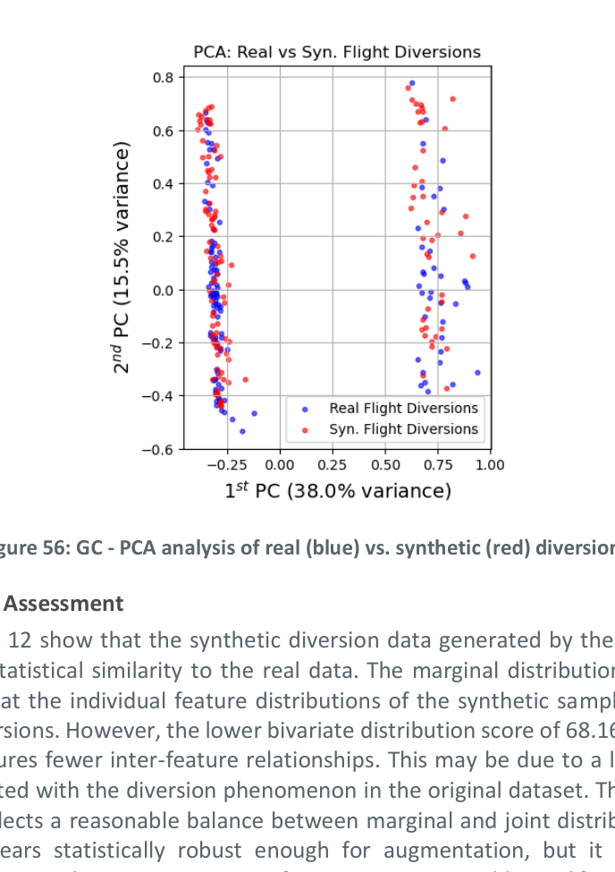
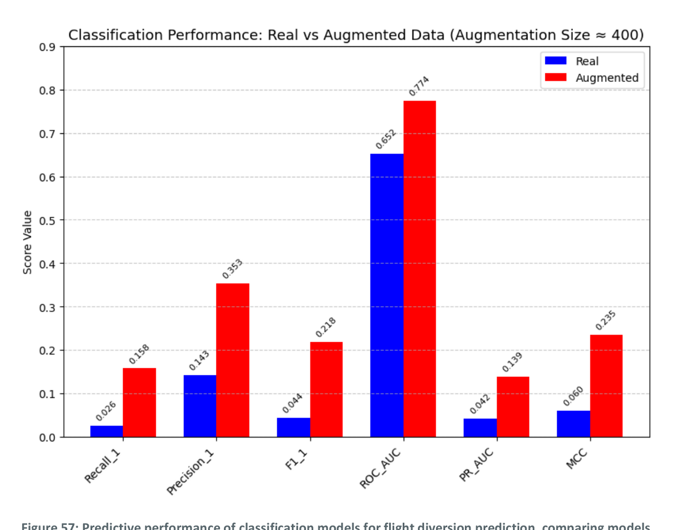

# UC5 - Flight Diversion Prediction

## Overview

Flight diversions occur when an aircraft is unable to land at its intended destination and must instead be rerouted to an alternate airport. These events can be triggered by severe weather conditions, medical emergencies, or technical malfunctions. Diversions not only disrupt flight schedules but also cause significant inconvenience to passengers and delays in cargo transport. They impose operational and economic burdens on airlines, airports, and air traffic management systems — especially at airports operating near capacity, where an unexpected surge in diverted flights can quickly lead to congestion and resource strain.

The primary challenge in developing diversion prediction models lies in the extreme class imbalance of historical datasets. Diversion events are relatively rare, resulting in highly imbalanced datasets that challenge the development of accurate predictive models. Augmenting real data with synthetically generated diversion events can help mitigate this issue. By enriching the dataset with realistic but diverse diversion scenarios, synthetic data enhances the robustness, accuracy, and generalisability of machine learning models trained to predict flight diversions.

## Dataset and Methodology

### Data Source

This use case leverages historical flight records from the **U.S. Bureau of Transportation Statistics (BTS)** database — the same source used in UC1, UC2, and UC6. Within this dataset, only **127 flights out of approximately 60,000** were recorded as diverted, resulting in a diversion rate of roughly 0.21% and a significant class imbalance that makes it difficult to train effective machine learning models.

### Synthetic Augmentation Strategy

To address this challenge, a targeted data augmentation strategy was adopted. Unlike previous use cases where the full dataset was used for generation, here only the 127 diverted flights were isolated to train a **Gaussian Copula (GC)** generative model. The goal was to generate realistic synthetic examples of diverted flights, which are then combined with the original data to create a more balanced training dataset.

The GC model was selected over the Tabular Variational Autoencoder (TVAE) due to its superior performance in previous use cases in terms of generating statistically realistic and hard-to-distinguish synthetic samples. TVAE, being a deep learning-based model, typically requires large datasets for effective training, making it less suitable for this use case given the small subset of 127 diversion cases.

Approximately **400 synthetic diversion cases** were generated and added to the real data to create the augmented training dataset.

### Prediction Task

The prediction task is binary classification: predict the **Diversion Label** (1 = diverted flight, 0 = non-diverted flight). The task is conducted in the **tactical phase**, where scheduled departure and arrival times, along with actual times up to take-off, are available. Actual arrival times remain unknown to the model, requiring it to infer the likelihood of diversion based solely on pre-arrival information.

Evaluation relies on classification metrics specifically designed for imbalanced datasets, including Recall, Precision, F1 score, ROC-AUC, PR-AUC, and Matthews Correlation Coefficient (MCC).

## Synthetic Data Quality Assessment

### Diversity Assessment

Both real and synthetic diversion records were projected into two-dimensional space using Principal Component Analysis (PCA) to visually assess the diversity and fidelity of the synthetic data.

*Figure 1: GC — PCA analysis of real (blue) vs. synthetic (red) flight diversions. The synthetic samples closely align with the distribution of real diversion events, indicating that the generative model effectively captures the key characteristics and variability present in the historical data.*

### Statistical Assessment

The synthetic diversion data generated by the GC model achieves moderate to high statistical similarity to the real data:

| Statistical Similarity | Generated with GC |
|------------------------|-------------------|
| **Marginal distribution** | 85.26% |
| **Bivariate distribution** | 68.16% |
| **Average** | **76.71%** |

The marginal distribution similarity score of **85.26%** indicates that individual feature distributions of the synthetic samples closely resemble those of actual diversions. The lower bivariate distribution score of **68.16%** suggests that the synthetic data captures fewer inter-feature relationships, which may reflect a lack of features strongly correlated with the diversion phenomenon in the original dataset. The average similarity score of **76.71%** reflects a reasonable balance between marginal and joint distributions. Overall, the synthetic data appears statistically robust enough for augmentation, though it could benefit from incorporating additional features more predictive of diversions.

### Detection Assessment

Classifiers trained to distinguish between real and synthetic flight diversion records achieved an **average accuracy of 62.46%** and an **average F1 score of 59.8%**. Since a discriminative score close to random guessing (50%) indicates high similarity, these results suggest that the synthetic data generated by the GC model is relatively hard to differentiate from real data. This supports the use of synthetic diversions for augmenting real datasets, especially for rare-event prediction tasks where data scarcity poses significant challenges.

| Discriminative Score | Generated with GC |
|----------------------|-------------------|
| Average accuracy | 62.46% |
| Average F1 score | 59.8% |

## Results: Utility Assessment

Models trained on the **augmented dataset** (real data + ~400 synthetic diversions) consistently outperformed those trained exclusively on real data across all classification metrics.

*Figure 2: Predictive performance of classification models for flight diversion prediction, comparing models trained on real (blue) vs. augmented (red) flight records (higher is better).*

The improvement is substantial across all metrics:

| Metric | Real Data Only | Real + Synthetic (Augmented) |
|--------|---------------|------------------------------|
| Recall (diversion class) | 0.026 | **0.158** |
| Precision (diversion class) | 0.143 | **0.353** |
| F1 score (diversion class) | 0.044 | **0.218** |
| ROC-AUC | 0.652 | **0.714** |
| PR-AUC | 0.042 | **0.139** |
| MCC | 0.060 | **0.235** |

The most striking improvements are in Recall (6× increase) and F1 score (5× increase), metrics that are most sensitive to the detection of the minority class. The ROC-AUC improvement from 0.652 to 0.714 confirms that the augmented model has substantially better discriminative ability overall. These results demonstrate the benefit of synthetic augmentation for rare event prediction.

## Operational Implications

### Impact of augmentation on rare event prediction

Synthetic data substantially improves model training and predictive performance for rare events such as flight diversions. By generating plausible and diverse synthetic instances of diversions and combining them with real historical cases, the issue of class imbalance is effectively mitigated. This was evident in the results, where all performance metrics improved when models were trained on augmented datasets compared to real data alone.

### Need for additional features to support prediction

The findings indicate that synthetic data alone cannot fully offset the absence of key operational variables. Features such as **real-time weather conditions** and **air traffic congestion** are likely critical for accurately predicting diversions. Without such inputs, model performance remains constrained — even when trained on augmented data — underscoring the importance of integrating synthetic augmentation with rich, domain-relevant real-world features that are strongly correlated with diversion events.

### Applicability to other rare event scenarios

The augmentation strategy demonstrated here — isolating rare events, training a targeted generative model, and blending synthetic cases into the training set — is directly transferable to other rare ATM scenarios such as emergency declarations, runway incursions, or severe weather encounters, wherever historical data is insufficient for robust model training.

## Conclusion

UC5 demonstrates that **synthetic data augmentation with Gaussian Copula effectively addresses the class imbalance challenge in flight diversion prediction**. The generated diversions are statistically plausible (76.71% average similarity) and sufficiently realistic to be difficult to distinguish from actual events (62.46% classifier accuracy). When used to augment real training data, they produce consistent and substantial improvements across all imbalanced-data classification metrics, with F1 score increasing from 0.044 to 0.218 and ROC-AUC from 0.652 to 0.714.

However, the overall prediction performance remains limited, reflecting that the BTS dataset lacks features directly correlated with the diversion phenomenon — particularly real-time weather and operational context. Future work should focus on enriching the feature set with domain-relevant variables to realise the full potential of synthetic augmentation for this safety-critical prediction task.
